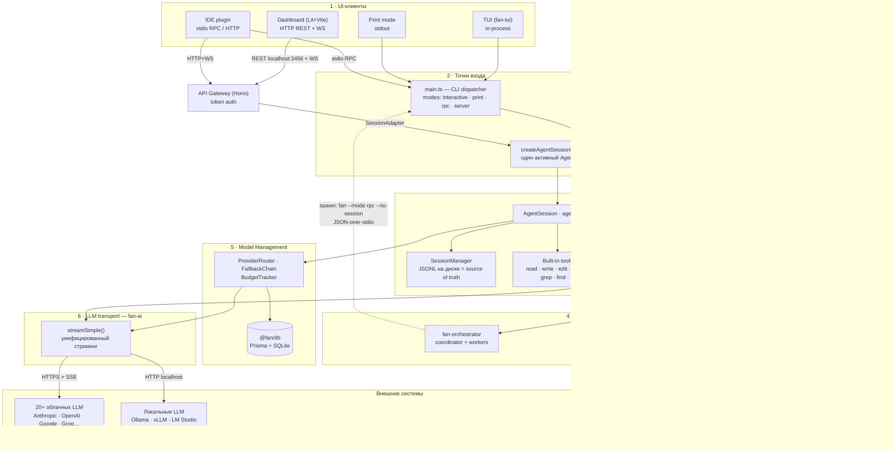
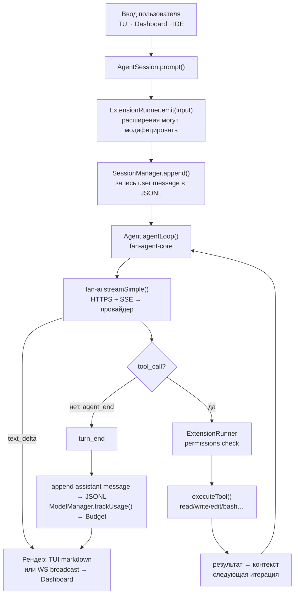
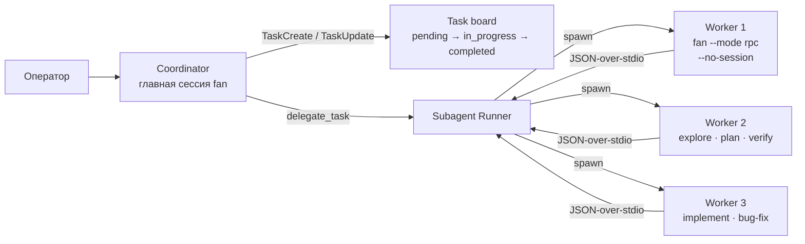

# FAN — Общая архитектура

Локальный AI runtime-agent для разработчиков. Монорепозиторий: Bun · TypeScript strict · npm workspaces · Hono REST+WS · Prisma+SQLite · Lit+Vite.

## 1. Общая схема — 6 слоёв, один хаб

Все пути ведут через `fan-coding-agent` — центральный хаб, импортирующий все остальные пакеты. Клиенты подключаются двумя путями: in-process (TUI) или через API Gateway (HTTP REST + WebSocket).



## 2. Поток данных end-to-end

Один и тот же путь `AgentSession.prompt()` используется всеми клиентами — TUI напрямую, Dashboard и IDE через API Gateway.



## 3. Многоагентный оркестратор

Оркестратор — standalone-расширение, не зашито в ядро. Каждый воркер — полноценный fan-процесс в RPC-режиме с JSON-over-stdio. Координатор владеет таск-бордом, воркеры — чистые исполнители.



Spawn воркера:

```js
spawn("fan", ["--mode", "rpc", "--no-session", "--no-extensions", "--no-skills"])
```

## 4. Пакеты монорепозитория

| Пакет | npm-имя | Роль |
|-------|---------|------|
| `packages/coding-agent` | `@seaagents/fan-coding-agent` | **Хаб**: CLI, сессии JSONL, built-in tools, расширения, скиллы |
| `packages/agent` | `@seaagents/fan-agent-core` | Agent runtime: `Agent`, `agentLoop()`, tool calling |
| `packages/ai` | `@seaagents/fan-ai` | LLM-абстракция: `streamSimple()`, 20+ провайдеров |
| `packages/tui` | `@seaagents/fan-tui` | Terminal UI: markdown-рендеринг, editor |
| `packages/web-ui` | `@seaagents/fan-web-ui` | Lit-компоненты чата (ChatPanel, Messages) |
| `packages/api-gateway` | `@fan/api-gateway` | Hono REST (14 endpoints) + WebSocket, token auth |
| `packages/dashboard` | `@fan/dashboard` | Lit+Vite веб-клиент (тонкий фронтенд) |
| `packages/model-manager` | `@fan/model-manager` | ProviderRouter, FallbackChain, BudgetTracker |
| `packages/db` | `@fan/db` | Prisma+SQLite: метаданные, модели, бюджеты, токены |
| `packages/store` | `@fan/store` | FAN Store пакетный менеджер |
| `packages/mcp` | `@fan/mcp` | MCP-клиент: внешние tool-серверы |

Порядок сборки отражает граф зависимостей: `db → tui → ai → agent → model-manager → api-gateway → web-ui → store → coding-agent → mcp`.

## 5. Где что хранится

| Данные | Расположение | Формат |
|--------|--------------|--------|
| **Сообщения сессий** — source of truth | `~/.fan/sessions/*.jsonl` или `.fan/sessions/` | JSONL на диске |
| Метаданные сессий, модели, бюджеты, токены | `~/.fan/agent/fan.db` | SQLite (Prisma) |
| API-ключи LLM-провайдеров | `~/.fan/agent/auth.json` | JSON |
| Кастомные модели (2000+) | `~/.fan/agent/models.json` | JSON, только global |
| Настройки | `~/.fan/agent/settings.json` + `.fan/settings.json` | JSON, 2 уровня |
| Расширения | project > user > builtin | директории с приоритетом |
| Скиллы | `skills/` (8 bundled) + `~/.fan/agent/skills/` | SKILL.md |

## 6. Ключевые архитектурные решения

1. **Disk-first.** JSONL на диске — единственный источник истины для сообщений. Runtime — stateless execution engine, одна активная сессия, `switchSession()` пересоздаёт AgentSession.
2. **Два пути к ядру.** In-process (TUI, Print) и API Gateway (Dashboard, IDE). Оба сходятся в `AgentSession.prompt()`.
3. **Оркестратор = расширение.** Воркеры — отдельные fan-процессы с JSON-over-stdio, полная изоляция от координатора.
4. **Двойная аутентификация.** ClientToken (SQLite) для HTTP/WS-клиентов + auth.json для LLM-провайдеров. `FAN_NO_AUTH=1` для dev.
5. **SessionAdapter pattern.** Интерфейс полностью отвязывает HTTP-сервер от coding-agent.
6. **Детерминированная сборка.** Порядок пакетов в build pipeline отражает граф зависимостей.

---

*Источник: code-research по ARCHITECTURE.md, package.json, packages/ · Интерактивная версия: [index.html](./index.html)*
