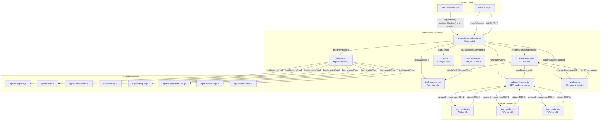
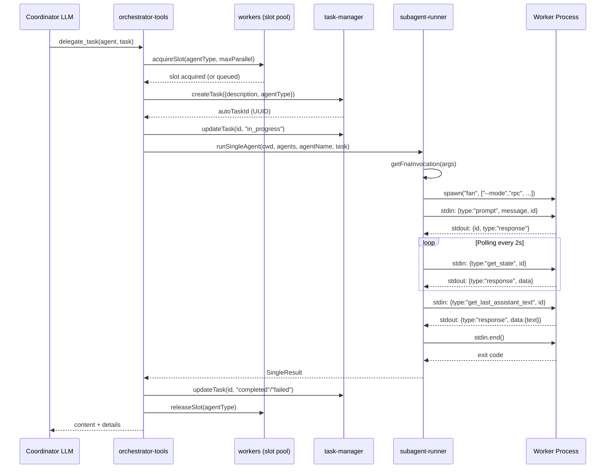
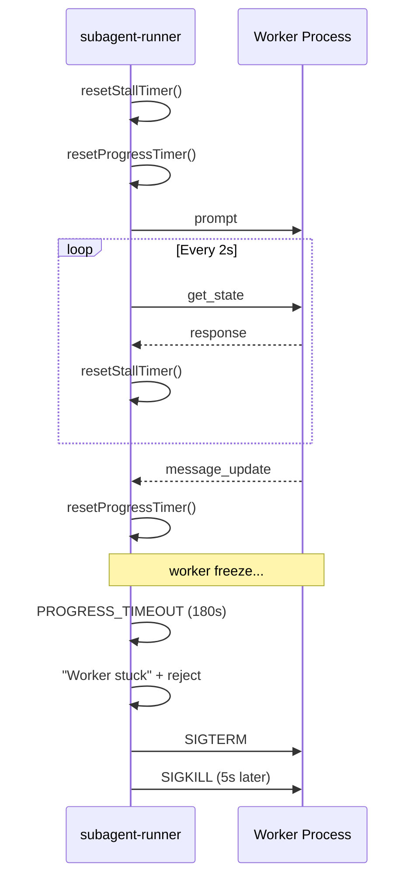

# Анализ архитектуры и работы FAN Orchestrator v4.1.0

**Дата:** 2026-06-05  
**Версия:** 4.1.0  
**Репозиторий:** `~/.fan/agent/extensions/fan-orchestrator/`  
**Тип:** FAN Store extension (bundled)  
**Entry point:** `orchestrator-extension.js`

---

## 1. Обзор архитектуры

Orchestrator v4.1.0 — это многолетное расширение (extension) для FAN, реализующее координацию нескольких агентов-воркеров через RPC-протокол. Он работает как **координатор** — LLM-агент управляет воркерами через инструменты, не вмешиваясь в их работу напрямую.

### Компоненты и их взаимодействие



### Диаграмма потока делегирования одного воркера



## 2. Entry point & жизненный цикл

**Файл:** `orchestrator-extension.js`

### Регистрация

Расширение экспортирует функцию `orchestratorExtension(pi)`, которая вызывается FAN при загрузке расширения:

| Событие/Хук | Место в коде | Назначение |
|---|---|---|
| `pi.registerShortcut("alt+o")` | строка 86-107 | Toggle coordinator mode |
| `pi.registerShortcut("alt+t")` | строка 109-114 | Toggle task widget collapse |
| `pi.on("before_agent_start")` | строка 117-124 | Inject coordinator prompt |
| `pi.on("turn_end")` | строка 127-129 | Update task widget |
| `pi.on("session_start")` | строка 131-164 | Build prompt, restore UI |
| `pi.on("session_shutdown")` | строка 166-180 | Abort workers, cleanup |
| `pi.on("tool_call")` | строка 183-206 | Dangerous bash interception |
| `pi.on("tool_result")` | строка 209-219 | Widget update after Task ops |
| `pi.registerCommand("orchestrator")` | строка 222+ | /orchestrator (10 subcommands) |
| `pi.registerCommand("plan")` | строка 515+ | /plan with approval flow |
| `pi.registerCommand("tasks")` | строка 671+ | /tasks |
| `pi.registerCommand("agents")` | строка 694+ | /agents |
| `pi.registerCommand("delegate")` | строка 718+ | /delegate |

### Жизненный цикл сессии

1. **session_start** — discoverAgents() + buildCoordinatorPrompt() + восстановление UI
2. **before_agent_start** — inject cachedCoordinatorPrompt в systemPrompt
3. **tool_call** — проверка dangerous commands для bash
4. **tool_result** — обновление widget для TaskCreate/Update/Clear
5. **session_shutdown** — abort всех воркеров, очистка registry/widgets/status

---

## 3. Worker spawning — RPC протокол

**Файл:** `subagent-runner.js`

### Параметры запуска

```javascript
const args = [
    "--mode", "rpc",
    "--no-session",
    "--no-extensions", "--no-skills",
    "--no-prompt-templates", "--no-themes",
];
if (agent.model) args.push("--model", agent.model);
if (agent.tools) args.push("--tools", agent.tools.join(","));
```

### Протокол (JSONL)

**Фаза 1: Отправка промпта**
```
→ stdin: {type: "prompt", message: fullPrompt, id: "orch-prompt"}
← stdout: {id: "orch-prompt", type: "response"}
```

**Фаза 2: Polling (каждые 2 секунды)**
```
→ stdin: {type: "get_state", id: "orch-state"}
← stdout: {id, type:"response", data:{isStreaming, model}}
```

**Фаза 3: Получение финального текста**
```
→ stdin: {type: "get_last_assistant_text", id: "orch-text"}
← stdout: {id, type:"response", data:{text}}
```

**Фаза 4: Завершение**
```
→ stdin.end()
```

### Live-прогресс

Worker отправляет `message_update` и `tool_execution_start` события с toolCall preview. Каждый вызов → `emitUpdate(status)` → `onUpdate()` callback.

---

## 4. Tool registration — 6 LLM-инструментов

**Файл:** `orchestrator-tools.js`  
**Функция:** `registerOrchestratorTools(pi, taskManager, config)`

### Инструменты

| Инструмент | Назначение | Параметры |
|---|---|---|
| `delegate_task` | Спавн воркеров | agent+task, tasks[], chain[] |
| `list_tasks` | Просмотр задач | status (opt) |
| `cancel_task` | Отмена задачи | taskId |
| `classify_task` | Определение типа | description |
| `TaskCreate` | Создание задачи | subject, description, owner, blocks[] |
| `TaskUpdate` | Обновление задачи | taskId, status, subject, blocks |
| `TaskClear` | Очистка завершённых | - |

### delegate_task — 3 режима

1. **Single** — {agent, task} — один воркер
2. **Parallel** — {tasks: [{agent,task}]} — до 8, concurrency 4
3. **Chain** — {chain: [{agent,task}]} — последовательно, {previous} placeholders

Каждый режим: auto-task creation (best-effort) → acquireSlot() → runSingleAgent() → releaseSlot() → updateTask("completed"/"failed")

### classify_task — эвристики

- explore: `explore|find|locate|search|grep|look for|what files|list|structure|where|which file`
- plan: `plan|design|architect|spec|how should|what approach|strategy|outline|propose`
- verify: `review|verify|check|test|audit|inspect|validate|security|quality`
- implement: default (confidence 0.5)

---

## 5. Agent discovery — поиск агентов

**Файл:** `agents.js`

### 3 источника

1. **Built-in** — `<execDir>/orchestrator/agents/` или `dist/agents/`
2. **User** — `~/.fan/agent/agents/`
3. **Project** — `.fan/agents/` (поиск от cwd до git root)

**Приоритет:** project > user > builtin (Map.set — последний побеждает)

### Формат

```markdown
---
name: explore
description: "Fast codebase exploration"
tools: read, grep, find, ls, bash
icon: 🔍
---
## ROLE
...
```

Агент считается `readOnly`, если нет `write` или `edit` среди tools.

### 8 встроенных агентов

| Агент | ReadOnly | Tools | Timeout |
|---|---|---|---|
| explore | ✅ | read,bash,grep,find,ls | 120s |
| plan | ✅ | read,bash,grep,find,ls | 180s |
| implement | ❌ | read,write,edit,bash,grep,find,ls | 300s |
| verify | ✅ | read,bash | 180s |
| bug-fix | ❌ | read,write,edit,bash,grep,find,ls | 300s |
| code-research | ✅ | read,bash,grep,find,ls | 120s |
| tests-impl | ❌ | read,write,edit,bash,grep,find,ls | 300s |
| docs-impl | ❌ | read,write,edit,bash,grep,find,ls | 300s |

---

## 6. Task Management — жизненный цикл задач

**Файл:** `task-manager.js`

### Состояния

```
    pending ──→ in_progress ──→ completed
       |            |               |
       |            +--→ failed     |
       |            |               |
       +──→ blocked─+               |
                                      |
        blocked ──→ pending ──────────+
```

Все переходы разрешены, кроме self→self.

### Ключевые методы

| Метод | Эффект | Авто-эффекты |
|---|---|---|
| createTask | UUID + pending | auto-block если blocks не завершены |
| startTask | → in_progress | - |
| completeTask | → completed | unblockDependents() |
| failTask | → failed | - |
| updateTask | частичное обновление | unblock при →completed |
| clearCompleted | удалить done/failed | - |

### Resolve by prefix

Частичные UUID (≥8 символов) — поиск по префиксу. При амбигвальности → ошибка.

### Auto-task tracking

При delegate_task автоматически создаётся задача:
```
[auto] implement: Create the main page...
→ in_progress → completed/failed
```

---

## 7. Slot Pool — управление конкурентностью

**Файл:** `workers.js`

### Модель

- `slotCount: Map<agentType, number>` — текущая загрузка
- `queue: Array<{agentType, resolve}>` — FIFO очередь

### Ограничения

| Тип | Макс. | Причина |
|---|---|---|
| implement | 1 | Эксклюзивный write-слот |
| bug-fix, tests-impl, docs-impl | 1 | toWorkerType → implement |
| explore, plan, verify | parallelWorkers (3) | Read-only, можно параллельно |

### Acquire/Release

acquireSlot: если счётчик < лимит → +1, иначе в очередь (Promise-based).
releaseSlot: -1, затем FIFO-пробуждение ожидающих.

---

## 8. Permissions — опасные команды

**Файл:** `permissions.js`

### 9 категорий

| Паттерн | Причина |
|---|---|
| rm -rf | Recursive force delete |
| git push --force/-f | Force push |
| npm/yarn/pnpm publish | Publishing package |
| DROP/TRUNCATE TABLE | Destructive SQL |
| DELETE FROM | Destructive SQL |
| format/mkfs/fdisk | Disk format |
| shutdown/reboot/halt/poweroff | System power ops |
| chmod/chown -R / | Root permission change |
| find ... -delete | Mass delete |

### Механизм

- Стриппинг кавычек (чтобы echo "rm -rf" не срабатывал)
- С UI: `ctx.ui.select(["Allow","Block"])`
- Headless: Block по умолчанию

---

## 9. Config — конфигурация

**Файл:** `config.js`

### Defaults

```javascript
cloud: { model: "zai/glm-4.5-air", models: {} }
local: { model: "ollama/qwen3:32b", models: {} }
providerMode: "cloud"
parallelWorkers: 3
workerTimeout: 300_000
maxRetries: 2
stallTimeout: 300_000
```

### Таймауты

- workerTimeout: Promise.race с AbortController
- stallTimeout: нет stdout данных (сброс при любых данных)
- progressTimeout: 180s, нет tool_call/message_update (hardcoded)
- agentTimeouts: per-agent (120s explore, 180s plan/verify, 300s implement)

### Provider modes

- cloud: только cloud, retry cloud
- local: только local, retry local
- auto: cloud → fallback local

### Per-agent models

resolveModel(): check config[provider].models[agentType] → config[provider].model


## 10. Progress rendering — визуализация в TUI

**Файл:** `orchestrator-tools.js`

### renderCall

- Single: `[ICON] AGENT worker` + `ЗАДАЧА: preview`
- Parallel: `⚡ PARALLEL worker (N tasks)` + список
- Chain: `🔗 CHAIN worker (N steps)` + номера

### renderResult

**Running (collapsed):**
```
⏳ ⏱ 45s | 💬 12 messages | 🔧 3 tools
  → read src/main.ts
  → grep /pattern/ in .
```

**Completed (collapsed):**
```
✓ (model-name)
Output content... (max 50 lines)
... N more lines (Ctrl+O to expand)
3 tools · 5 msgs · 45s · ↑1.2k ↓0.5k
```

**Completed (expanded):**
Container с Text/Spacer/Markdown, список всех tool calls, footer.

**Chain/Parallel mode:**
Каждый шаг/воркер в отдельном блоке, агрегированный footer.

### FormatToolCall

- bash: `$ cmd` (muted + toolOutput)
- read: `read path:1-50` (muted + accent + warning)
- write: `write path (N lines)` (muted + accent + dim)
- edit: `edit path` (muted + accent)
- grep: `grep /pat/ in path` (muted + accent + dim)

---

## 11. Watchdog — таймеры прогресса и стопора

**Файл:** `subagent-runner.js`

### progressTimer (180s hardcoded)

Сбрасывается при:
- message_update с toolCall или text
- tool_execution_start

При срабатывании:
```
reject(new Error("Worker stuck"))
proc.kill("SIGTERM"); setTimeout(proc.kill("SIGKILL"), 5000)
```

### stallTimer (config.stallTimeout, default 300s)

Сбрасывается при любых stdout данных.

При срабатывании:
```
reject(new Error("Worker stalled"))
proc.kill("SIGTERM"); setTimeout(proc.kill("SIGKILL"), 5000)
```

### Схема



---

## 12. Coordinator prompt — динамическая сборка

**Файл:** `agents.js`, функция `buildCoordinatorPrompt()`

### Структура промпта

1. Заголовок: `## ORCHESTRATOR MODE`
2. Critical rule: не использовать инструменты напрямую
3. Таблица воркеров из agent definitions
4. Список read-only (параллельные) и write (эксклюзив)
5. Routing rules: какой агент для чего
6. Workflow: decompose → explore → synthesize → implement → verify → report → cleanup
7. Auto-task tracking

### Когда перестраивается

Только при session_start. Если agent discovery падает → статический COORDINATOR_PROMPT (200+ строк, 4 базовых воркера).

---

## 13. Потенциальные проблемы и улучшения

### Проблемы

#### 1. Нет rate limiting для emitUpdate
**subagent-runner.js** — частые tool_execution_start → избыточные обновления UI.

#### 2. Resolve by prefix амбигвален
**task-manager.js** — при совпадении префикса ≥8 символов → ошибка.

#### 3. Auto-task creation best-effort
**orchestrator-tools.js** — try/catch без гарантий создания задачи.

#### 4. Progress vs Stall конфликт
**subagent-runner.js** — если процесс спамит невалидным JSON, stall не срабатывает, но progress может наступить.

#### 5. Нет очистки таймеров при abort
**subagent-runner.js** — при abort сигнале clearStallTimer/clearProgressTimer не вызываются явно.

#### 6. TaskManager не thread-safe
**task-manager.js** — race condition при parallel delegate_task.

### Улучшения

1. **Throttle emitUpdate** — debounce 100ms
2. **Гарантированное auto-task** — убрать try/catch
3. **Унификация таймеров** — единый heartbeat с разными порогами
4. **Graceful shutdown** — явная очистка таймеров в killProc
5. **Mutex для TaskManager** — очередь операций create/update
6. **Динамическое обновление промпта** — ребилд при появлении новых агентов

---

## 14. Выводы

1. **Архитектура** — чёткое разделение на 8 компонентов с единой точкой входа (`orchestrator-extension.js`).

2. **RPC протокол** — эффективный асинхронный JSONL-обмен с 2s polling и live-обновлениями.

3. **Безопасность** — 9 категорий опасных команд с интерактивным Allow/Block диалогом.

4. **Конкурентность** — slot pool разделяет read-only (параллельные) и write (эксклюзивные) воркеры, Promise-based FIFO.

5. **Таймауты** — трёхуровневая защита: stall (нет данных), progress (нет прогресса), total (абсолютный лимит) с SIGTERM→SIGKILL.

6. **Визуализация** — богатая система рендеринга: collapsed/expanded, live tool preview, агрегированная статистика для chain/parallel.

7. **Гибкость** — per-agent model overrides, provider fallback (auto), динамический coordinator prompt, backward compatibility.

8. **Слабые места** — отсутствие rate limiting для UI-обновлений, best-effort auto-task creation, потенциальные race conditions в TaskManager при параллельном режиме, отсутствие динамического ребилда промпта внутри сессии.

