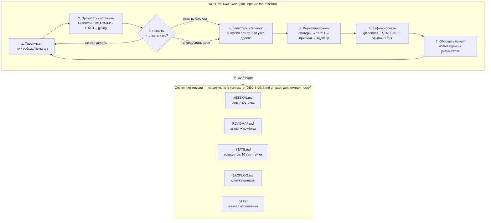
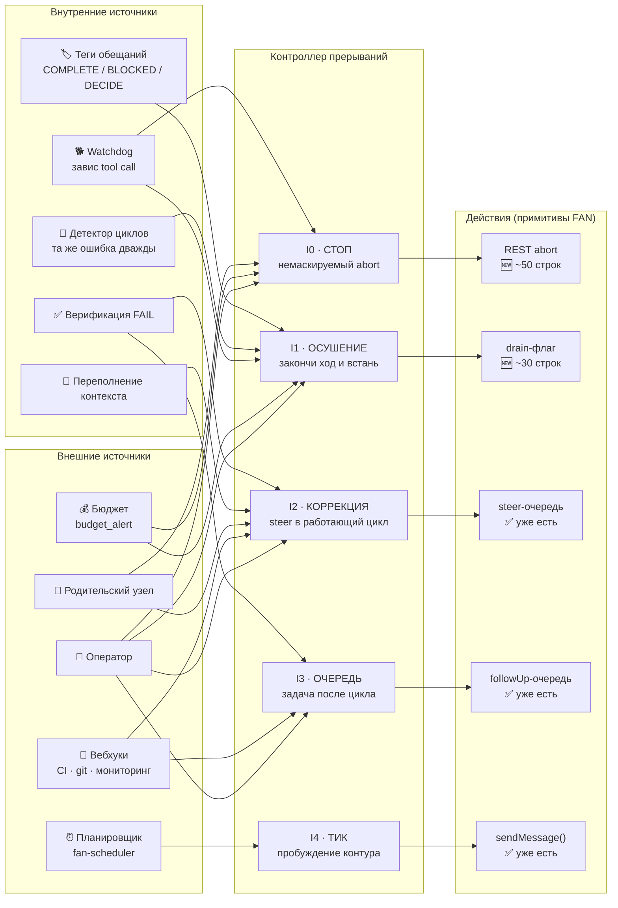
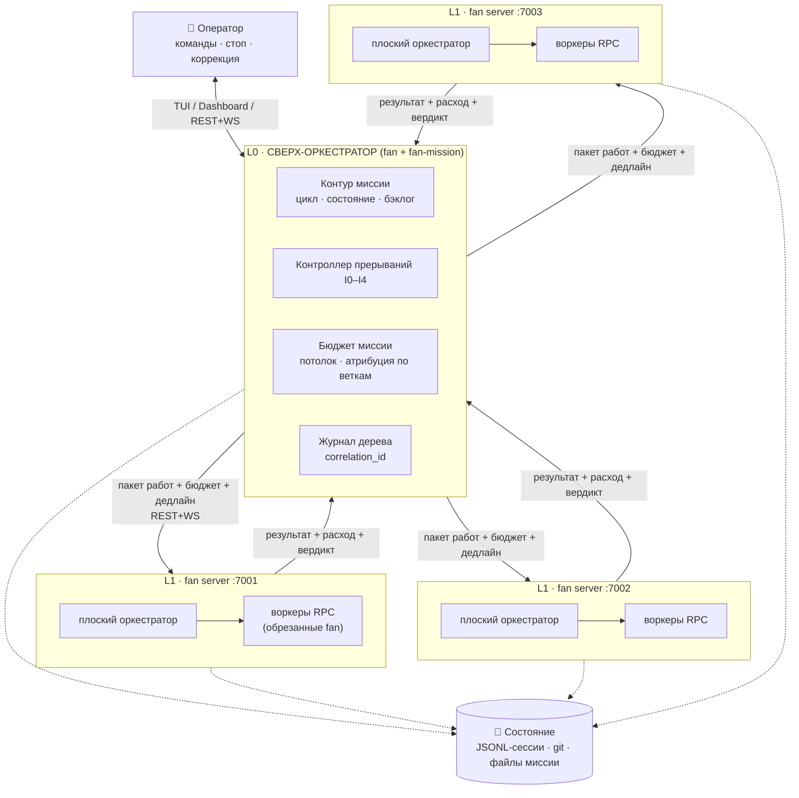

# Спецификация: Сверх-оркестратор FAN

## Метаданные
- **Дата:** 2026-08-10
- **Статус:** Спецификация v2
- **Версия:** 2.0
- **Заменяет:** `spec_super-orchestrator_2026-08-09.md` (черновик v1)
- **Тип:** Новая фича (расширения FAN Store + изменения ядра)
- **Источники:**
  - `.fan/lavish/fan-super-orchestrator-architecture.html` — архитектурная схема (основа)
  - `docs/research/idea-lab/super-orchestrator/Сверх-оркестратор FAN — исследование идеи.md` — исследование: SWOT, альтернативы, MoSCoW
  - `docs/research/idea-lab/super-orchestrator/Бесконечные миссии и система прерываний.md` — миссионный контур, прерывания, circuit breakers
  - `.fan/reports/code-research-orchestrator-architecture.md` — факты по кодовой базе (пути, строки)
  - `.fan/reports/code-research-long-running-primitives.md` — примитивы для долгих миссий, gaps с LOC

---

## 1. Обзор

### 1.1 Цель

Сверх-оркестратор — система, способная длительно (часы и дни) и автономно работать над большими проектами. Под глобальную задачу динамически выстраивается иерархия агентов: управленцы верхних уровней декомпозируют миссию, координаторы средних уровней ведут фронты работ, воркеры нижних уровней исполняют.

**Ключевые свойства:**
- Миссионный контур (mission loop) — детерминированный внешний цикл с файловым состоянием
- Система прерываний I0–I4 по аналогии с приоритетами операционной системы
- HTTP-иерархия узлов — дерево процессов `fan server` (рабочая глубина 3–4, предохранитель 12)
- Контрольный слой: глобальный бюджет, лимиты глубины/ширины, трассировка, санитизация границ
- Восстановление при 8 типах сбоев с максимальной потерей в одну незавершённую итерацию
- Визуализация дерева узлов и статуса миссии в TUI и Dashboard

### 1.2 Контекст

Текущий оркестратор FAN плоский: один координатор порождает воркеров через `subagent-runner.js` (RPC, `--no-extensions`), глубина жёстко равна 1. На больших эпиках координатор упирается в контекст и становится узким местом.

**Что уже есть в FAN (фундамент):**
- JSONL-персистентность + `continueRecent()` — сессии переживают рестарты (`packages/coding-agent/src/core/session-manager.ts:1337`)
- Очереди steer/followUp — транспорт прерываний I2/I3 (`packages/agent/src/agent.ts:250-270`)
- `fork()` — ветвление и основа чекпоинтов (`packages/coding-agent/src/core/agent-session-runtime.ts:181`)
- Автокомпактификация с хуками расширений (`packages/coding-agent/src/core/compaction/compaction.ts:219`)
- 27 событий расширений — точки обработки прерываний (`packages/coding-agent/src/core/extensions/types.ts:980-1030`)
- `fan server` — готовый headless-узел дерева с REST+WS API, daemon-режимом (`packages/coding-agent/src/cli/server-command.ts`, `packages/coding-agent/src/main.ts:1253-1310`)
- WS-события + `budget_alert` — каналы сигналов наружу: тип `WsBudgetAlert` определён (`packages/api-gateway/src/types.ts:229-237`), Dashboard слушает, но серверный продюсер события отсутствует — нужно добавить (~40 LOC)
- Stall timer в оркестраторе — прообраз watchdog (`extensions/fan-orchestrator/subagent-runner.js`)
- Маркер `VERDICT: PASS/FAIL/PARTIAL` — протокол верификации (`extensions/fan-orchestrator/agents.js:parseVerdict`)
- Процессная изоляция воркеров: `child_process.spawn` + JSONL RPC по stdin/stdout (`extensions/fan-orchestrator/subagent-runner.js:236-552`)
- API Gateway: 16+ REST-эндпоинтов + WebSocket (`packages/api-gateway/src/http-server.ts`)

**Чего не хватает:**
- REST/WS abort — остановить генерацию извне невозможно (~50 LOC, `packages/api-gateway/src/http-server.ts`)
- Лимиты очередей — безразмерные, утечка на бесконечной миссии (~20 LOC, `packages/agent/src/agent.ts`)
- Watchdog + детектор циклов — нет защиты от зависания и зацикливания (~160 LOC)
- Режим осушения (drain) — abort рубит немедленно с потерей хода (~30 LOC, `packages/coding-agent/src/core/agent-session.ts`)
- Сквозная трассировка (correlation_id) по дереву
- Глобальный бюджет для дерева — BudgetTracker независим per-process (`packages/model-manager/src/budget.ts`)

**Исследования (внешние):**
- DeepMind (дек 2025): неструктурированные агентные сети усиливают ошибки до 17.2× относительно одиночного агента; выигрыш координации выходит на плато после ~4 агентов на конвейер
- MAST (1642 трассы, 7 фреймворков): частота отказов 41–86.7%; 36.9% отказов — сбои координации между агентами; 41.8% — системный дизайн; 21.3% — преждевременное завершение
- Gartner: более 40% агентных ИИ-проектов будут закрыты к концу 2027 из-за убегающей стоимости и отсутствия контролей риска
- Token Budget Management (июнь 2026): предел на один прыжок — не более 30k токенов; избирательная передача контекста экономит 30–50%
- AdaptOrch (2026): топология оркестрации даёт 12–23% разницы в результате — правильная иерархия это бесплатный прирост качества
- Арифметика надёжности: шаг с успехом 85% → 10 шагов = 19.7% общего успеха, 20 шагов = 3.9%, 50 шагов = 0.03%. Сброс вектора вероятностей на каждом шаге — единственный способ работать долго

### 1.3 Решения пользователя

| Решение | Выбор | Обоснование |
|---------|-------|-------------|
| Модель исполнения | Отдельные процессы `fan server` | Полная изоляция, наблюдаемость, «полноценные агенты» |
| Рабочая глубина | 3–4 уровня | DeepMind: плато после ~4 агентов; усиление ошибок в глубоких деревьях |
| Лимит глубины | 12 (предохранитель) | Жёсткий лимит в коде, не рабочий режим; защита от убегающей рекурсии |
| Ширина на родителя | 3–4 узла | Плато координации; 12×12 = 144 процесса физически нереалистичны |
| Контур миссии | Этап 0 — до иерархии | Контур даёт ценность на одном узле; дерево подключается позже |
| Формат миссии | CLI-инициализация + markdown-файлы | Человекочитаемость, git-совместимость |
| Управление | TUI slash-команды + виджет + Dashboard | Базовый контроль в TUI, расширенный в браузере |
| Генерация идей | Гибрид (контур + DECIDE) | Баланс автономности и контроля |

### 1.4 Описание решения (высокоуровневое)

Система строится как два ортогональных измерения:

1. **Миссионный контур (ось времени)** — детерминированный внешний цикл, владеющий состоянием миссии через файлы (`MISSION.md`, `ROADMAP.md`, `STATE.md`, `BACKLOG.md`, `DECISIONS.md`). Короткие сессии сменяют друг друга; между сессиями состояние сохраняется на диске. Контур управляется прерываниями I0–I4. Процессы смертны по дизайну — смерть дёшева, восстановление бесплатно.

2. **HTTP-иерархия узлов (ось ширины)** — когда задача слишком велика для одного узла, контур порождает дочерние процессы `fan server` на выделенных портах. Каждый узел — полноценный FAN со своим плоским оркестратором. Родитель управляет ребёнком через REST+WS. Контрольный слой обеспечивает бюджет, лимиты и трассировку.

Бесконечность существует только на вершине — в контуре, и выражена файлами миссии, а не бессмертными процессами. Каждый узел L1 получает ограниченный пакет работ с бюджетом и дедлайном.

---

## 2. Архитектура решения

### 2.1 Схема 1: Контур миссии — сердце системы

Главный цикл, который живёт вечно. Каждый проход — одна ограниченная итерация (короткая сессия агента). Между итерациями состояние фиксируется на диске: смерть процесса ничего не стоит.



**Текстовое описание:** Контур миссии — расширение `fan-mission` — выполняет 7-шаговый цикл. На каждом шаге 1 контур пробуждается (тик I4 от `fan-scheduler`, вебхук от `fan-webhook`, или команда оператора). На шаге 2 читает файлы миссии и git log для восстановления контекста. На шаге 3 принимает решение: запустить идею из бэклога, сгенерировать новые идеи, или остановиться. Шаг 4 — запуск итерации (короткая сессия агента или узел дерева для крупных задач). Шаг 5 — верификация по лестнице проверок. Шаг 6 — атомарная фиксация (git commit + обновление STATE.md + чекпоинт через `fork()`). Шаг 7 — обновление бэклога новыми идеями из результатов. Состояние миссии хранится в пяти файлах миссии (MISSION, ROADMAP, STATE, BACKLOG, DECISIONS) и в журнале git на диске, а не в контексте агента.

### 2.2 Схема 2: Система прерываний — пять уровней

Аналогия с операционной системой: бесконечный планировщик, управляемый прерываниями разного приоритета. Источники слева, контроллер в центре, действия над агентом справа.



**Текстовое описание:** Пять уровней прерываний (I0–I4) аналогичны приоритетам в операционной системе. I0 (немаскируемый стоп) — немедленный abort через REST-эндпоинт; I1 (осушение) — закончить текущий ход и встать; I2 (коррекция) — инъекция steer-сообщения между вызовами инструментов; I3 (очередь) — задача после завершения текущего цикла; I4 (тик) — периодическое пробуждение контура. Внешние источники: оператор, планировщик `fan-scheduler`, вебхуки `fan-webhook`, бюджетные сигналы `budget_alert`, родительский узел дерева. Внутренние источники: watchdog (зависший tool call), детектор циклов (повтор той же ошибки), переполнение контекста, провал верификации, теги обещаний агента. Два уровня (I2, I3) используют существующие очереди FAN (`packages/agent/src/agent.ts:250-270`); три действия (steer-очередь, followUp-очередь, `sendMessage()`) уже реализованы; два действия (REST abort ~50 LOC, drain-флаг ~30 LOC) нужно добавить.

### 2.3 Схема 3: Полная топология — контур + дерево процессов

Контур — ось времени (живёт вечно, наверху). Дерево — ось ширины (порождается по мере нужды, процессы смертны). Узлы второго уровня — полноценные `fan server` на своих портах; внутри каждого — обычный плоский оркестратор с воркерами.



**Текстовое описание:** На вершине — L0 (сверх-оркестратор на базе `fan` + расширение `fan-mission`): контур миссии, контроллер прерываний, бюджет миссии с атрибуцией по веткам, журнал дерева со сквозным `correlation_id`. Оператор взаимодействует через TUI, Dashboard или REST+WS. L0 порождает дочерние узлы L1 — полноценные процессы `fan server` на выделенных портах (7001, 7002, 7003). Каждый L1-узел содержит обычный плоский оркестратор FAN, который управляет RPC-воркерами через существующий механизм `subagent-runner.js`. Рабочая ширина 3–4 узла на родителя (исследования: плато координации после ~4 агентов). Лимит 12×12 остаётся предохранителем в коде, не рабочим режимом. Каждый узел отчитывается перед родителем: результат, расход (токены/стоимость), вердикт. Всё состояние — JSONL-сессии, git, файлы миссии — на диске, переживает любой сбой.

---

## 3. Функциональные требования

### 3.1 Миссионный контур

#### 3.1.1 Внешний цикл (mission loop)

**Что делается:** Детерминированный цикл из 7 шагов, работающий поверх связки «миссионные файлы + короткие сессии + прерывания». Реализуется как расширение `fan-mission` (FAN Store).

**Где в кодовой базе:** Новое расширение `extensions/fan-mission/`. Использует хуки расширений: `agent_end` (`packages/coding-agent/src/core/extensions/types.ts:1013`) — завершение итерации, обновление STATE.md; `session_start` (`types.ts:992`) — инициализация контура при старте миссии; `session_shutdown` — сохранение состояния. Взаимодействует с ядром через `actions.sendMessage()`, `actions.abort()`, `actions.compact()`.

**Алгоритм цикла:**
```
while (миссия активна):
  1. ПРОСНУТЬСЯ   ← тик I4, вебхук, команда оператора
  2. ПРОЧИТАТЬ    MISSION.md, ROADMAP.md, STATE.md, git log
  3. РЕШИТЬ       что запускать: идея из бэклога / генерация / доработка / стоп
  4. ЗАПУСТИТЬ    итерацию = сессия (или узел дерева для крупных задач)
  5. ВЕРИФИЦИР.   лестница проверок + непробиваемая метрика
  6. ЗАФИКСИР.    git commit + STATE.md + чекпоинт (fork)
  7. ОБНОВИТЬ     бэклог идей (новые из результатов)
```

**Ключевой принцип:** информация, нужная новой сессии для продолжения, обязана помещаться в структурированный файл, читаемый за 30 секунд. Сырые логи инструментов и переписка — почти никогда не нужны; дистиллированные решения, блокеры и состояние — всегда.

**Интерфейс:**
- CLI: `fan mission start [--dir <path>]` — запуск контура
- TUI: `/mission:start`, `/mission:stop`, `/mission:status`, `/mission:pause`
- События расширения: `mission_tick`, `mission_iteration_start`, `mission_iteration_end`, `mission_complete`

**Критерии приёмки:**
- Контур выполняет ≥10 итераций без деградации качества (проверка на синтетической миссии)
- Состояние между итерациями полностью в файлах — новая сессия читает `STATE.md` за <30 секунд
- Каждая итерация завершается git-коммитом (если верификация пройдена)
- При abort контура состояние сохраняется, перезапуск продолжает с последней точки

#### 3.1.2 Файлы миссии: форматы и правила

**Где:** `docs/missions/<slug>/` в репозитории проекта.

| Файл | Содержимое | Кто пишет | Формат |
|------|-----------|-----------|--------|
| `MISSION.md` | Цель, рамки, непробиваемая метрика успеха, запреты | Оператор (контур не меняет) | Markdown с YAML frontmatter |
| `ROADMAP.md` | Декомпозиция на этапы с критериями приёмки | Контур по решению агента-планировщика | Markdown, checklist с `[ ]`/`[x]` |
| `STATE.md` | Текущая позиция: что сделано, блокеры, следующие шаги | Контур после каждой итерации | Markdown, читаемый за <30 сек |
| `BACKLOG.md` | Идеи-кандидаты с оценками (скор, источник, статус) | Генератор идей + оператор | Markdown-таблица |
| `DECISIONS.md` | Журнал архитектурных решений с обоснованием | Итерации записывают | Markdown, ADR-формат |

**Формат `MISSION.md`:**
```markdown
---
mission_id: mission-<uuid>
created: 2026-08-10T10:00:00Z
status: active | paused | completed | aborted | failed | budget_exhausted
metric_type: test_pass_rate | build_success | coverage | custom
metric_command: "npm run test:integration"
budget_tokens: 500000
budget_usd: 10.00
max_depth: 4
max_width: 4
---
# Миссия: <название>
## Цель
## Рамки
## Непробиваемая метрика
## Запреты
```

**Дисциплина STATE.md:** файл обязан содержать ровно три секции — «Сделано», «Блокеры», «Следующие шаги» — суммарным объёмом не более 5 KB. Это обеспечивает чтение за 30 секунд и машинный парсинг регулярными выражениями.

**Критерии приёмки:**
- Каждый файл имеет чёткий формат с валидацией схемы
- `MISSION.md` frontmatter валидируется при старте; отсутствие обязательных полей → ошибка
- Контур не модифицирует `MISSION.md` после инициализации
- `STATE.md` ограничен 5 KB, проверяется автоматически

#### 3.1.3 Генерация и оценка идей

**Алгоритм:**
1. **Генератор** — периодическая итерация (по тику I4 или завершении этапа): анализ результатов, огрехов, возможностей → кандидаты в `BACKLOG.md`. Опционально использует скилл `idea-lab` (быстрый обзор).
2. **Оценщик** — детерминированный скоринг по критериям: соответствие `MISSION.md` (вес 0.3), стоимость (0.2), риск (0.2), ожидаемая ценность (0.3). Кандидаты выше порога (0.7) → в ROADMAP. Спорные (0.5–0.7) → прерывание I3 оператору (`DECIDE:вопрос`). Ниже 0.5 → отклонение с записью в `DECISIONS.md`.
3. **Исполнение** — по приоритетам из ROADMAP: один пункт = одна сессия или ветка дерева.
4. **Верификация** — лестница: статика → линтеры → сборка → тесты → приёмочная команда пункта → независимый аудитор в свежем контексте. План без терминальной проверки на пункт отклоняется ещё на стадии планирования (паттерн Nyquist-валидации из GSD).

**Непробиваемая метрика** — главный урок Autoresearch: любая метрика, которую агент может накрутить, будет накручена. Требования: метрика вычисляется кодом, который агент структурно не может изменить; для инженерных задач — внешний интеграционный тест-сьют без прав записи у агента; «сделано» определяется до написания промптов.

**Критерии приёмки:**
- Генератор создаёт ≥1 идеи на каждые 3 завершённых итерации
- Скоринг воспроизводим (одинаковые входные данные → одинаковый скор)
- DECIDE-прерывание блокирует контур до ответа оператора
- Все решения (принятые/отклонённые) записываются в `DECISIONS.md`

### 3.2 Система прерываний

#### 3.2.1 Уровни I0–I4

| Уровень | Название | Семантика | Аналог в ОС | Механизм в FAN |
|---------|----------|-----------|-------------|----------------|
| I0 | **Стоп** (немаскируемое) | Немедленный abort: kill генерации, состояние сохраняется как «aborted» | NMI / SIGKILL | REST `POST /api/sessions/:id/abort` 🆕 ~50 LOC |
| I1 | **Осушение** (drain) | «Закончи текущий ход и встань»: graceful-пауза на границе итерации | SIGTERM + drain | Флаг `drainAfterCurrentTurn` в `agent-session.ts` 🆕 ~30 LOC |
| I2 | **Коррекция** (steer) | Инъекция сообщения в работающий цикл между вызовами инструментов — агент учитывает немедленно | IRQ | Очередь steering ✅ уже есть (`agent.ts:250-270`) |
| I3 | **Постановка** (follow-up) | Задача после завершения текущего цикла | Deferred call | Очередь followUp ✅ уже есть |
| I4 | **Тик** (heartbeat) | Периодическое пробуждение контура: проверить состояние, решить — продолжать, спать или порождать работу | Timer планировщика | Расширение `fan-scheduler` (setInterval + `actions.sendMessage()`) 🆕 |

#### 3.2.2 Источники прерываний

**Внешние:**
| Источник | Уровень | Механизм в FAN |
|----------|---------|----------------|
| Оператор (TUI/CLI/REST) | I0–I3 | Slash-команды `/mission:*`, REST abort, steer/followUp через API |
| Таймеры/расписание (`fan-scheduler`) | I4 | `setInterval` + `actions.sendMessage()` на событии `session_start` |
| Вебхуки CI, git-push, мониторинг (`fan-webhook`) | I2–I3 | Микро-Hono внутри расширения; паттерн доказан `packages/coding-agent/examples/extensions/file-trigger.ts` |
| Файловая система | I2–I3 | `fs.watch` → `sendMessage()` (пример: `packages/coding-agent/examples/extensions/file-trigger.ts`) |
| Бюджетные сигналы | I0–I1 | WS-событие `budget_alert` (warning/critical/exceeded) — тип и потребитель есть, продюсер события нужно добавить (~40 LOC) |
| Родительский узел дерева | I0–I3 | REST+WS API дочернего `fan server` |

**Внутренние:**
| Источник | Уровень | Механизм |
|----------|---------|----------|
| Watchdog (зависший tool call) | I0–I1 | Таймер на `tool_execution_start` без `tool_execution_end` за N минут 🆕 |
| Детектор циклов | I1 | Тот же инструмент + те же параметры + та же ошибка дважды → стоп + запрет подхода 🆕 |
| Переполнение контекста | I2 (авто) | Уже есть: auto-compact → auto-retry при overflow (`compaction.ts:219`) |
| Верификация провалена | I2–I3 | `VERDICT: FAIL` → новая итерация с диагностикой; парсинг `agents.js:parseVerdict` |
| Исчерпание бюджета итерации | I1 | Бюджет на итерацию с записью состояния и пометкой «не завершено» 🆕 |
| Терминальные теги обещаний | I1 | `<promise>COMPLETE</promise>` / `BLOCKED:причина` / `DECIDE:вопрос` / `FAILED:диагноз` 🆕 |

#### 3.2.3 Контроллер прерываний

**Где:** Модуль `extensions/fan-mission/interrupt-controller.ts`.

**Логика:**
1. Слушает все источники (REST, WS, fs.watch, таймеры, внутренние события)
2. Приоритизация: I0 > I1 > I2 > I3 > I4
3. Маршрутизация:
   - I0 → `actions.abort()` + запись `STATE.md` (status: aborted)
   - I1 → установка флага drain + запись `STATE.md` (status: draining)
   - I2 → `POST /api/sessions/:id/messages` с `{ message: msg, streamingBehavior: "steer" }`
   - I3 → `POST /api/sessions/:id/messages` с `{ message: msg, streamingBehavior: "followUp" }`
   - I4 → проверка условий продолжения + `POST /api/sessions/:id/messages` с `{ message: "tick", streamingBehavior: "followUp" }`
4. Дедупликация: повторяющиеся I2/I3 в течение 5 секунд схлопываются
5. Логирование: каждое прерывание записывается в `DECISIONS.md` с timestamp и источником

**Критерии приёмки:**
- I0 останавливает выполнение за <1 секунду
- I1 позволяет текущему tool call завершиться, затем останавливает
- I2 доставляется между tool calls без потери
- I3 не теряется при перезапуске сессии
- Каждое прерывание залогировано

#### 3.2.4 Протоколы: теги обещаний, steer/followUp

**Теги обещаний** — структурированный протокол, по которому недетерминированный агент сообщает детерминированному контуру терминальное состояние:
```
<promise>COMPLETE</promise>          — задача выполнена
<promise>BLOCKED:<причина></promise> — блокер, нужна помощь
<promise>DECIDE:<вопрос></promise>   — требуется решение оператора
<promise>FAILED:<диагноз></promise>  — провал с диагностикой
```

**Обработка тегов:** Контур парсит выход агента регулярными выражениями:
- `COMPLETE` → верификация → фиксация → следующая итерация
- `BLOCKED` → запись в `STATE.md` → эскалация (I3 оператору или I0 при таймауте)
- `DECIDE` → пауза контура, ожидание `/mission:decide`
- `FAILED` → анализ диагноза → повтор с другой стратегией (если бюджет позволяет) или эскалация

**Steer/FollowUp:** Используются существующие очереди FAN (`packages/agent/src/agent.ts:250-270`). Ограничения для бесконечной миссии:
- Лимит очереди: 50 сообщений 🆕 (~20 LOC в `agent.ts`)
- Dead-letter: сообщения старше 1 часа без доставки → `DECISIONS.md` как «пропущенное прерывание»

### 3.3 HTTP-иерархия узлов

#### 3.3.1 Менеджер дочерних процессов

**Где:** `extensions/fan-super-orchestrator/process-manager.ts`

**Функции:**
- **Выделение портов:** Пул `7001–7099` (настраивается). Порт блокируется в `~/.fan/agent/child-ports.json` на время жизни узла. Проверка свободы: попытка bind.
- **Запуск:** `fan server start --port <N> --host 127.0.0.1` через `child_process.spawn` (detached). PID сохраняется в `~/.fan/agent/child-<id>.pid`.
- **Health-check:** `GET /api/health` каждые 5 секунд. 3 провала подряд → маркировка «unhealthy» → рестарт (1 попытка) → при повторном провале → эскалация родителю.
- **Kill-switch:** `fan server stop` (SIGTERM → 5s → SIGKILL, уже реализовано в `packages/coding-agent/src/cli/server-command.ts:113`). Принудительная остановка всех дочерних при abort миссии.
- **Возврат порта:** При остановке узла порт освобождается в `child-ports.json`.

**Критерии приёмки:**
- Узел стартует и проходит health-check за <10 секунд
- Порт не назначается дважды
- Kill-switch останавливает всё поддерево за <10 секунд
- При crash дочернего процесса родитель обнаруживает это через health-check за <15 секунд

#### 3.3.2 Протокол «пакет работ» (L0 → L1)

Контракт задачи, передаваемой от родителя к дочернему узлу. Используется существующий `SendMessageRequest` (`packages/api-gateway/src/types.ts:82-85`):

```json
{
  "message": "{\"work_package\":{\"task\":\"Реализовать middleware авторизации\",\"correlationId\":\"mission-uuid/L1/node-3\",\"depth\":1,\"spawnBudget\":4,\"tokenBudget\":50000,\"costBudgetUsd\":2.00,\"toolManifest\":[\"read\",\"write\",\"edit\",\"bash\",\"grep\",\"find\",\"ls\"],\"deadline\":\"2026-08-10T14:00:00Z\",\"verificationCommand\":\"npm run test:unit\",\"context\":{\"parentSummary\":\"Миссия рефакторинга auth, этап 2 из 4\",\"relevantFiles\":[\"src/middleware/auth.ts\",\"tests/auth.test.ts\"],\"constraints\":[\"не менять public API\"]}}}",
  "streamingBehavior": "followUp"
}
```

**Поля:**
- `task` — трассируемая тема задачи (уникальная в рамках миссии)
- `correlationId` — сквозной ID для трассировки по дереву
- `depth` — текущая глубина (guard: `depth < maxDepth`, жёсткий предел 12)
- `spawnBudget` — максимум дочерних узлов, которые L1 может породить
- `tokenBudget` — лимит токенов на узел (рекомендация: ≤30k на прыжок)
- `costBudgetUsd` — лимит стоимости в долларах
- `toolManifest` — декларативный манифест разрешённых инструментов (минимальные привилегии)
- `deadline` — ISO-8601 дедлайн
- `verificationCommand` — команда верификации результата
- `context` — избирательная передача контекста (экономия 30–50% токенов по Padiso)

**Передача глубины:** При запуске дочернего `fan server` глубина передаётся через env `FAN_ORCHESTRATOR_DEPTH=<N>`. Guard в `subagent-runner.js` проверяет `depth < maxDepth` (12).

#### 3.3.3 Протокол «отчёт узла» (L1 → L0)

Родитель подписывается на WS `/api/ws/:sessionId` дочернего узла, ждёт событие `agent_end`. Извлекает финальный результат из последнего assistant message.

**Формат отчёта (структура в памяти родителя):**
```json
{
  "nodeId": "L1/node-3",
  "correlationId": "mission-uuid/L1/node-3",
  "status": "completed | failed | aborted | timeout",
  "verdict": "PASS | FAIL | PARTIAL",
  "result": {
    "text": "финальный текст ответа",
    "filesModified": ["src/module.ts"],
    "filesCreated": ["tests/module.test.ts"],
    "commitsMade": ["abc1234"]
  },
  "usage": {
    "inputTokens": 15000,
    "outputTokens": 8000,
    "costUsd": 0.45,
    "turns": 12,
    "durationMs": 180000
  },
  "children": [
    {"nodeId": "L2/node-3.1", "usage": {"costUsd": 0.12}, "status": "completed"}
  ],
  "completionReason": "task_completed | budget_exhausted | deadline_reached | aborted"
}
```

**Критерии приёмки:**
- Родитель получает отчёт в течение 5 секунд после `agent_end` дочернего
- `usage` агрегируется рекурсивно (включая детей детей)
- `verdict` парсится по маркеру `VERDICT: PASS|FAIL|PARTIAL` (расширение на межпроцессный протокол)
- При таймауте (deadline) узел останавливается, отчёт помечается `status: timeout`

#### 3.3.4 Агрегация бюджета

**Модель:** «Родитель выделяет детям» — L0 имеет общий бюджет миссии, при порождении L1 выделяет долю.

**Алгоритм:**
1. L0 знает `budget_total` (из `MISSION.md` frontmatter)
2. При порождении L1: `budget_allocated += L1.tokenBudget`. Если `budget_allocated > budget_total` → отказ в порождении
3. L1 отчитывается: при `agent_end` → `usage` добавляется в `budget_consumed`
4. L0 проверяет: `budget_consumed / budget_total > 0.8` → alert (I2 steer); `> 1.0` → останов новых порождений (I1 drain)
5. Агрегация рекурсивна: L1 отчитывается за своих детей

**Освобождение доли:** При завершении узла (`node_completed` / `node_failed`): `budget_allocated -= L1.tokenBudget` — аллокация возвращается в доступный бюджет миссии. Инвариант: `budget_allocated` = сумма долей всех **активных** (не завершённых) узлов.

**`Global Budget Coordinator`** (глобальный координатор бюджета): хранится в `~/.fan/agent/mission-budget.json`. Ключи: `mission_id`, `allocated`, `consumed`, `peak`, `by_branch` (расход по веткам дерева). Обновляется атомарно (запись во временный файл → `rename`).

#### 3.3.5 Журнал дерева

**Где:** `extensions/fan-super-orchestrator/tree-journal.ts`

**Формат:** JSONL-файл `docs/missions/<slug>/tree-journal.jsonl`. Каждая запись:
```json
{
  "timestamp": "2026-08-10T10:15:30Z",
  "event": "spawn | complete | fail | abort",
  "nodeId": "L1/node-3",
  "parentId": "L0",
  "correlationId": "mission-uuid/L1/node-3",
  "task": "краткое описание задачи",
  "depth": 1,
  "port": 7003,
  "usage": {"inputTokens": 15000, "outputTokens": 8000, "costUsd": 0.45}
}
```

**Критерии приёмки:**
- Каждое порождение и завершение записано
- По журналу можно восстановить полную топологию дерева
- Журнал не теряет записи при crash (append-only, fsync)
- CLI выводит дерево в читаемом формате (`fan mission tree <slug>`)

#### 3.3.6 `Startup-reconciliation` (стартовая сверка)

При запуске контура миссии проверяется `child-ports.json` и обнаруживаются orphaned процессы — записи, PID которых не принадлежит текущему родительскому процессу (после crash родителя).

**Алгоритм:**
1. Прочитать `~/.fan/agent/child-ports.json`
2. Для каждой записи: `process.kill(pid, 0)` — если PID существует, но не является дочерним → orphan
3. Orphan: `SIGTERM` → ожидание 5 сек → `SIGKILL`
4. Очистить записи, освободить порты
5. Записать в `tree-journal.jsonl`: `{"event": "orphan_cleanup", ...}`

### 3.4 Восстановление при сбоях

Ключевой принцип: контур между тиками безсостоятелен — каждый тик начинается с чтения диска. Поэтому любой сбой откатывает систему максимум до последней зафиксированной итерации. «Умереть» для процесса дёшево, «проснуться» — бесплатно.

| # | Сбой | Что происходит | Механизм восстановления | Чего не хватает |
|---|------|----------------|-------------------------|-----------------|
| 1 | Обрыв интернета | LLM-вызов падает по сетевой ошибке | `FallbackChain` переключает на резервную модель/провайдера (уже есть, `packages/model-manager/src/model-manager.ts`). Полный офлайн → итерация помечается незавершённой, контур засыпает до следующего тика и перечитывает состояние | Офлайн-политика в fan-mission (P1) |
| 2 | Ошибки LLM (429, overloaded) | Провайдер возвращает retryable-ошибку | Авто-ретрай + авто-компактификация — уже есть (события `auto_retry_start/end`) | — |
| 3 | Переполнение контекста | Ошибка провайдера об overflow | Детект → авто-компактификация → повтор (уже есть, 1 попытка, `compaction.ts:219`) | Многоуровневая суммаризация (P3) |
| 4 | Зависание tool call | Нет `tool_execution_end` за N минут | Watchdog → прерывание I1, диагностика, ретрай с запретом подхода. Паттерн stall timer уже есть в `subagent-runner.js` | Сам watchdog (P0, ~80 LOC) |
| 5 | Смерть процесса (kill, сбой ОС) | Теряется только незавершённый ход; JSONL на диске цел | `continueRecent()` при старте поднимает сессию (`session-manager.ts:1337`); файлы миссии + git показывают позицию; контур на тике продолжает с последнего коммита | Автоперезапуск демона — супервизор ОС (Task Scheduler / systemd) + персистентное расписание тиков (P1) |
| 6 | Смерть узла дерева | Ветка миссии оборвана | L0 видит потерю health-check → ветка failed → узел перезапускается или пакет переназначается другому узлу | Менеджер процессов (этап 2) |
| 7 | Разрыв WebSocket | Потерян стрим событий наблюдателю | Переподключение + переподписка (уже есть); источник правды — JSONL, а не стрим | — |
| 8 | Сбой посреди фиксации | Незавершённый коммит / дубль побочного эффекта | Идемпотентность: ключ = ID миссии + номер шага; повтор не дублирует действие; обратимые действия имеют компенсации (паттерн саг) | Дисциплина компенсаций в fan-mission (P1) |

**Максимальная потеря при любом сценарии** — одна незавершённая итерация. Всё зафиксированное (коммиты, STATE.md, журнал дерева) переживает любой сбой.

### 3.5 Circuit breakers — трёхслойные автоматические выключатели

Обязательные параметры, определяемые ДО первого запуска:

1. **Бюджетный слой** — жёсткий потолок токенов/денег на итерацию и на миссию. При исчерпании контур не просто рубит: записывает состояние, помечает задачу незавершённой, эскалирует (I3 оператору). Реализуется через `BudgetTracker` (`packages/model-manager/src/budget.ts`) + расширение бюджета на итерацию.

2. **Детектор циклов** — семантическое сходство последовательных вызовов инструментов: тот же инструмент + те же параметры + та же ошибка дважды → останов, в следующий контекст впрыскивается явный запрет прежнего подхода. Тупой таймаут недостаточен — после перезапуска агент вернётся в ту же ловушку. Реализуется в `packages/coding-agent/src/core/agent-session.ts` (~80 LOC).

3. **Сторожевой таймер (watchdog)** — на каждый `tool_execution_start`; нет `tool_execution_end` за N минут → сигнал I1 + диагностика. В порождённых воркерах stall timer уже работает (`subagent-runner.js`); нужен аналог на уровне runtime. Реализуется в `packages/coding-agent/src/core/agent-session.ts` (~80 LOC).

### 3.6 Визуализация

#### TUI-виджет миссии

**Где:** `extensions/fan-mission/mission-widget.ts` (по образцу task widget оркестратора)

**Переключение:** Alt+M (аналог Alt+O для оркестратора)

**Содержимое:**
```
┌─ Миссия: Рефакторинг auth ────────────────────────┐
│ Статус: ● активна │ Итерация: 7/12 │ Этап: Тесты │
│ Расход: $3.45 / $10.00 (34.5%)                   │
│ Узлы: L0(активен) → L1[3] L2[5]                  │
│ Прерывания: 2 steer, 1 DECIDE (ожидает)          │
└──────────────────────────────────────────────────┘
```

#### Dashboard-компоненты

**Где:** `packages/dashboard/src/components/mission/`

- `<mission-status>` — статус миссии, итерация, расход, бюджет (Lit-компонент)
- `<mission-tree>` — дерево узлов в реальном времени (обновление через WS)
- `<mission-log>` — журнал событий миссии (лента)
- `<mission-budget>` — визуализация расхода по веткам (столбчатая диаграмма)

Данные: Dashboard получает через REST API (`/api/missions/:id/status`, `/api/missions/:id/tree`) и WS (`mission_event`).

---

## 4. Пользовательские сценарии

### Сценарий 1: Инициализация и запуск миссии

**Актор:** Оператор (разработчик)

1. Оператор выполняет `fan mission init auth-refactor --template refactor`
2. Создаётся `docs/missions/auth-refactor/` с 5 файлами-шаблонами
3. Оператор редактирует `MISSION.md`: указывает цель, метрику (`npm run test:integration`), бюджет (500k токенов, $10)
4. Оператор редактирует `ROADMAP.md`: добавляет 4 этапа с критериями приёмки
5. Оператор запускает `fan mission start --dir docs/missions/auth-refactor`
6. Контур валидирует файлы, создаёт сессию, начинает первую итерацию

**Результат:** Миссия запущена, TUI-виджет отображает статус.

### Сценарий 2: Наблюдение и коррекция курса

**Актор:** Оператор

1. Миссия на 5-й итерации, этап «Написание тестов»
2. Оператор нажимает Alt+M — виджет показывает: 5/8 итераций, $3.45/$10, 3 L1-узла активны
3. Оператор замечает, что агент идёт не туда → `/mission:steer "Сфокусируйся на auth middleware, не на UI"`
4. Прерывание I2 доставляется в steering-очередь, агент учитывает между tool calls
5. Миссия продолжает работу с учётом коррекции

### Сценарий 3: DECIDE-прерывание — генерация идей

**Актор:** Контур → Оператор

1. Контур завершает этап, генератор идей предлагает 3 кандидата
2. Кандидат A (скор 0.85) → автоматически в ROADMAP
3. Кандидат B (скор 0.62) → DECIDE-прерывание: «Добавить рефакторинг database layer? Скор 0.62, риск средний»
4. Контур встаёт (I3), виджет показывает «Ожидает решения оператора»
5. Оператор: `/mission:decide "Да, но только миграции, без изменения схемы"`
6. Контур возобновляет работу, идея записана в ROADMAP с пометкой оператора

### Сценарий 4: Аварийная остановка (I0)

**Актор:** Оператор / Система

1. Миссия работает, L1-узел на порту 7003 зациклился (детектор циклов обнаружил)
2. Детектор генерирует I1 → drain узла 7003
3. Одновременно оператор видит аномальный расход → `/mission:stop`
4. I0: немедленный abort всех узлов, kill дочерних процессов
5. `STATE.md` записывает status: aborted, последняя рабочая точка сохранена
6. Все порты освобождены, процессы остановлены

### Сценарий 5: Сбой дочернего узла и восстановление

**Актор:** Система (автоматически)

1. L1-узел на порту 7002 crash (OOM)
2. Health-check обнаруживает (3 провала за 15 секунд)
3. Менеджер процессов: рестарт (1 попытка) → health-check → повторный crash
4. Менеджер эскалирует родителю: `node_failed` с диагностикой
5. L0 (контур): помечает задачу узла как «не завершена», анализирует
6. Контур перезапускает задачу на новом узле (порт 7004) с тем же пакетом работ
7. Идемпотентность: ключ = `mission_id + step_number` — дублирование исключено

### Сценарий 6: Сутки миссии

**Актор:** Контур (автоматически), Оператор (эпизодически)

Пример: миссия «довести проект X до релиза». Оператор задал MISSION.md вечером и ушёл — дальше контур сам.

| Время | Событие |
|-------|---------|
| **03:00** | **Тик I4.** Планировщик `fan-scheduler` будит контур. Читаются STATE.md, ROADMAP.md, git log. Следующий пункт: «модуль платежей». Свободного бюджета достаточно — запуск итерации. |
| **03:05** | **Порождение дерева.** Пункт крупный → старт узла L1 (`fan server :7001`) с пакетом работ и бюджетом 50k токенов. Внутри узла плоский оркестратор разводит воркеров. |
| **03:40** | **Внутреннее прерывание I1.** Watchdog: воркер висит 12 минут на одном tool call. Стоп, диагностика, ретрай с другим подходом. Журнал дерева записал событие по `correlation_id`. |
| **04:20** | **Итерация завершена.** Лестница верификации: линтеры → сборка → тесты → приёмочная команда → независимый аудитор. PASS → атомарный коммит, STATE.md обновлён, узел L1 остановлен (процессы смертны по дизайну). |
| **04:25** | **Генерация идей.** По результатам в BACKLOG.md добавлены 3 кандидата. Скоринг: один выше порога — в ROADMAP; один спорный → прерывание I3 оператору (`DECIDE: стоит ли менять схему БД?`). |
| **06:00** | **Тик I4, внешнее событие.** Вебхук из CI: ночной прогон тестов упал. Контур ставит итерацию «разбор падения» в начало очереди. |
| **09:15** | **Оператор проснулся.** Видит в дашборде: 4 завершённых пункта, журнал дерева, расход по веткам, один вопрос DECIDE. Отвечает → steer-прерывание I2 корректирует курс без остановки работы. |
| **11:30** | **Бюджетное прерывание I1.** Дневной потолок на 80%: `budget_alert: critical`. Контур осушает текущую итерацию, фиксирует состояние, засыпает до следующего тика. Ничего не потеряно. |

**Ключевое:** оператор нужен только для решений (DECIDE), стопов и курса. Рутина цикла — полностью на контуре.

### Сценарий 7: Бюджетное ограничение

**Актор:** Система (автоматически)

1. Миссия: бюджет $10, потрачено $8.05 (80.5%)
2. Агрегатор бюджета генерирует alert (I2 steer): «Бюджет на 80%, сократите объём работ»
3. Контур получает steer, корректирует стратегию: отказывается от генерации идей, фокус на завершение
4. При $9.50 (95%): I1 drain — контур завершает текущую итерацию и останавливается
5. `STATE.md`: status: budget_exhausted, описание оставшейся работы
6. Оператор может увеличить бюджет в `MISSION.md` и `/mission:resume`

---

## 5. Нефункциональные требования

### 5.1 Производительность

| Параметр | Значение | Обоснование |
|----------|----------|-------------|
| Запуск дочернего узла | <10 сек | `fan server start` + health-check |
| Доставка steer (I2) | <500 мс | Очередь в памяти, без сетевого round-trip для локального |
| Health-check интервал | 5 сек | Баланс между скоростью детекции и нагрузкой |
| WS-задержка визуализации | <5 сек | Приемлемо для оператора |
| Чтение STATE.md | <30 сек | Ограничение на размер файла (~5 KB) |
| Остановка по I0 | <1 сек | REST abort + kill дочерних |
| Остановка по I1 (drain) | <30 сек | Завершение текущего tool call |
| `Startup-reconciliation` (стартовая сверка) | <10 сек | Обнаружение и очистка orphaned процессов |

### 5.2 Надёжность

**Crash recovery:**
- Состояние миссии — в файлах (MISSION.md, STATE.md, ROADMAP.md), переживает crash процесса
- JSONL-сессии восстанавливаются через `continueRecent()` (`session-manager.ts:1337`), JSONL пишется синхронно через `appendFileSync()` на каждое сообщение
- tree-journal.jsonl — append-only с fsync, не теряет записи
- Дочерние процессы перезапускаются менеджером (1 попытка), затем эскалация

**Идемпотентность:**
- Ключ идемпотентности: `mission_id + step_number` (детерминированный, не зависит от переформулировки модели)
- Каждое внешнее действие (коммит, вызов API) помечается: обратимое (с компенсацией — паттерн саг) или необратимое (требует подтверждения)
- Git-коммит после каждой задачи = durable-журнал: новая сессия читает историю

**Защита от зацикливания:**
- Детектор циклов: тот же инструмент + те же параметры + та же ошибка дважды → стоп + запрет подхода
- Бюджет итерации: при исчерпании — запись состояния, пометка «не завершено», эскалация
- Circuit breaker: 3 провала на одном этапе → останов миссии с диагностикой

### 5.3 Безопасность

**Санитизация границ:**
- Все межагентные сообщения санитизируются как недоверенный ввод
- `toolManifest` ограничивает инструменты на узле (минимальные привилегии)
- Prompt injection между уровнями: входные данные от дочерних узлов не включаются в системный промпт родителя напрямую — только через структурированный отчёт
- Манифесты инструментов на узел — декларативный список разрешённых инструментов, применяются через `--tools` при запуске дочернего `fan server`

**Аутентификация:**
- REST abort требует ClientToken-аутентификации (как все эндпоинты API Gateway, `packages/api-gateway/src/auth.ts`)
- steer/followUp через API — только для авторизованных клиентов
- Внутренние прерывания (детектор циклов, watchdog) не требуют авторизации

**Изоляция:**
- Каждый узел — отдельный процесс с отдельной сессией
- Дочерний `fan server` слушает только на `127.0.0.1` (не на 0.0.0.0)
- PID-файлы и port-registry очищаются при остановке

### 5.4 Масштабируемость

**Лимиты:**
- Глубина: рабочая 3–4, предохранитель 12 (env `FAN_MAX_DEPTH`)
- Ширина: 3–4 на родителя (настраивается), предохранитель 12 (env `FAN_MAX_WIDTH`)
- Бюджет токенов на прыжок: ≤30k (рекомендация, настраивается)
- Общий бюджет миссии: определяется оператором в `MISSION.md`
- Одна активная миссия на машину — контур миссии эксклюзивен

**Плато координации (DeepMind):**
- После ~4 агентов на конвейер добавление агентов перестаёт давать выигрыш
- MAST: 36.9% отказов мультиагентных систем — сбои координации
- DeepMind: неструктурированные сети усиливают ошибки до 17.2×
- MAST: 41.8% отказов — системный дизайн; 21.3% — преждевременное завершение

**Ресурсы хоста:**
- Порт на узел: пул 7001–7099 (99 портов, настраивается)
- Память: ~100 MB на `fan server` процесс → 16 процессов = ~1.6 GB (допущение: ширина 4, глубина 2, дерево 1+4+16=21 узел, из них 16 одновременно активных; реалистичный предел)
- Дескрипторы файлов: ~50 на процесс → 16 × 50 = 800 (в пределах `ulimit -n` по умолчанию)

---

## 6. Технические требования

### 6.1 Модули и расширения

#### fan-mission (расширение FAN Store, P1)

**Назначение:** Миссионный контур, система прерываний, файлы состояния, генерация и оценка идей, верификация.

**Структура:**
```
extensions/fan-mission/
├── extension.json          # манифест расширения
├── mission-loop.ts         # внешний цикл (7 шагов)
├── interrupt-controller.ts # контроллер прерываний I0–I4
├── file-state-manager.ts   # чтение/запись MISSION.md, STATE.md, etc.
├── idea-generator.ts       # генерация и скоринг идей
├── verification-ladder.ts  # лестница проверок
├── mission-widget.ts       # TUI-виджет (Alt+M)
├── slash-commands.ts       # /mission:start|stop|status|pause|resume|steer|decide
└── types.ts                # типы
```

**Оценка:** ~1600 LOC

**Точки интеграции с ядром:**
- `session_start` hook (`packages/coding-agent/src/core/extensions/types.ts:992`) — инициализация контура
- `agent_end` hook (`types.ts:1013`) — завершение итерации, обновление STATE.md
- `tool_execution_start` / `tool_execution_end` hooks — точки watchdog и детектора циклов
- `actions.sendMessage()` — инъекция steer/followUp
- `actions.abort()` — аварийная остановка
- `actions.compact()` — принудительная компактификация

#### fan-scheduler (расширение FAN Store, P1)

**Назначение:** Тики I4 (heartbeat), cron-расписание для миссии.

**Структура:**
```
extensions/fan-scheduler/
├── extension.json
├── scheduler.ts            # setInterval + cron parser
└── types.ts
```

**Механизм:** При `session_start` → `setInterval(tickHandler, intervalMs)`. При тике: проверка условий → `POST /api/sessions/:id/messages` с `{ message: "tick", streamingBehavior: "followUp" }`.

**Оценка:** ~175 LOC

#### fan-webhook (расширение FAN Store, P1)

**Назначение:** Слушатель вебхуков (CI, git-push, мониторинг) → прерывания I2/I3.

**Структура:**
```
extensions/fan-webhook/
├── extension.json
├── webhook-server.ts       # микро-Hono, принимает POST
├── event-router.ts         # маршрутизация событий → steer/followUp
└── types.ts
```

**Механизм:** При `session_start` запускает Hono micro-server на выделенном порту. Принимает POST → парсит → `actions.sendMessage()`. Паттерн доказан примером `packages/coding-agent/examples/extensions/file-trigger.ts`.

**Оценка:** ~250 LOC

#### fan-super-orchestrator (расширение FAN Store, P2)

**Назначение:** HTTP-иерархия узлов, менеджер процессов, бюджет, журнал дерева.

**Структура:**
```
extensions/fan-super-orchestrator/
├── extension.json
├── process-manager.ts      # запуск/остановка/health-check дочерних fan server
├── child-node-client.ts    # REST+WS клиент для управления дочерним узлом
├── budget-aggregator.ts    # агрегация расхода по дереву
├── tree-journal.ts         # журнал порождений (JSONL)
├── port-allocator.ts       # выделение/возврат портов
├── depth-guard.ts          # проверка глубины (env FAN_ORCHESTRATOR_DEPTH)
├── sanitizer.ts            # санитизация межагентных сообщений
├── orchestrator-tools.ts   # LLM-tools: SpawnNode, StopNode, NodeStatus
└── types.ts
```

**Оценка:** ~2350 LOC

#### Изменения ядра

| # | Изменение | Файл | LOC | Приоритет |
|---|-----------|------|-----|-----------|
| 1 | REST/WS abort эндпоинт | `packages/api-gateway/src/http-server.ts`, `packages/api-gateway/src/ws-handler.ts` | ~50 | P0 |
| 2 | Лимиты очередей сообщений | `packages/agent/src/agent.ts` (MessageQueue, :250-270) | ~20 | P0 |
| 3 | Сторожевой таймер runtime | `packages/coding-agent/src/core/agent-session.ts` | ~80 | P0 |
| 4 | Детектор циклов | `packages/coding-agent/src/core/agent-session.ts` | ~80 | P0 |
| 5 | Режим осушения (drain) | `packages/coding-agent/src/core/agent-session.ts` | ~30 | P1 |
| 6 | Checkpoint API (явный) | `packages/coding-agent/src/core/agent-session.ts` | ~100 | P2 |
| 7 | Бюджет на итерацию | `packages/model-manager/src/budget.ts` | ~60 | P2 |
| 8 | Продюсер `budget_alert` | `packages/api-gateway/src/ws-handler.ts` | ~40 | P0 |

**Итого изменений ядра:** ~460 LOC

> *Сноска: P0/P1/P2 = порядок внедрения по этапам, не важность; важность отражена в MoSCoW (раздел 11).*

### 6.2 API контракты

#### Новые REST-эндпоинты

| Метод | Путь | Описание | Модуль | Приоритет |
|-------|------|----------|--------|-----------|
| POST | `/api/sessions/:id/abort` | Abort сессии (I0) | api-gateway | P0 |
| GET | `/api/missions/:id/status` | Статус миссии | fan-mission | P1 |
| GET | `/api/missions/:id/tree` | Дерево узлов | fan-super-orchestrator | P2 |
| GET | `/api/missions/:id/budget` | Бюджет миссии | fan-super-orchestrator | P2 |
| WS | `/api/ws/mission/:id` | События миссии | fan-mission | P1 |

#### Модифицируемые эндпоинты

| Путь | Изменение |
|------|-----------|
| `POST /api/sessions/:id/messages` | `streamingBehavior: "steer"` для I2 уже поддерживается (`packages/api-gateway/src/types.ts:84`) |
| `WS /api/ws/:sessionId` | Поддержка команды `abort` (сейчас только ping/subscribe) |

### 6.3 CLI/TUI команды

#### CLI: `fan mission`

| Команда | Описание |
|---------|----------|
| `fan mission init <slug> [--template T]` | Инициализация файлов миссии |
| `fan mission start [--dir <path>]` | Запуск контура миссии |
| `fan mission stop` | Остановка текущей миссии (I0) |
| `fan mission status` | Статус текущей миссии |
| `fan mission pause` | Осушение (I1) |
| `fan mission resume` | Возобновление после паузы |
| `fan mission tree <slug>` | Вывод дерева узлов из журнала |

**Реализация:** `packages/coding-agent/src/cli/mission-command.ts` (по образцу `server-command.ts`)

#### TUI slash-команды

| Команда | Описание | Уровень прерывания |
|---------|----------|-------------------|
| `/mission:start` | Запуск контура | — |
| `/mission:stop` | Немедленная остановка | I0 — abort |
| `/mission:pause` | Осушение: закончить итерацию и встать | I1 — drain |
| `/mission:resume` | Возобновление после паузы | — |
| `/mission:status` | Вывод текущего состояния | — |
| `/mission:steer <msg>` | Инъекция сообщения в работающий цикл | I2 — steer |
| `/mission:decide <answer>` | Ответ на DECIDE-прерывание | I3 — followUp |

### 6.4 Форматы данных

#### Файлы миссии

Описаны в разделе 3.1.2. Расположение: `docs/missions/<slug>/`.

#### Состояние миссии (runtime)

Хранится в `~/.fan/agent/mission-state.json`:

```json
{
  "$schema": "fan-mission-state/v1",
  "missionId": "mission-<uuid>",
  "slug": "auth-refactor",
  "status": "active | paused | completed | aborted | failed | budget_exhausted",
  "currentIteration": 7,
  "currentPhase": "Тесты",
  "startedAt": "2026-08-10T10:00:00Z",
  "lastIterationAt": "2026-08-10T12:30:00Z",
  "budget": {
    "totalTokens": 500000,
    "totalUsd": 10.00,
    "consumedTokens": 175000,
    "consumedUsd": 3.45,
    "allocatedTokens": 200000,
    "allocatedUsd": 4.00
  },
  "tree": {
    "rootNodeId": "L0",
    "activeNodes": [
      {"nodeId": "L1/node-3", "port": 7003, "status": "active", "depth": 1}
    ],
    "completedNodes": 5,
    "failedNodes": 0
  },
  "interrupts": {
    "pending": [],
    "processed": 12
  }
}
```

#### Журнал дерева

Описан в разделе 3.3.5. Формат: JSONL (`docs/missions/<slug>/tree-journal.jsonl`).

### 6.5 Стек и интеграции

| Компонент | Технология | Обоснование |
|-----------|-----------|-------------|
| Транспорт между уровнями | REST (Hono) + WebSocket | Уже существует в `fan server`; 16+ эндпоинтов покрывают управление сессиями |
| Процессы узлов | `fan server start` (detached spawn, PID-файлы) | Готовый daemon-режим, graceful stop (`server-command.ts:113`) |
| Протокол результата | WS-события до `agent_end` + извлечение финального сообщения | Асинхронная природа API; синхронный клиент — новый модуль |
| Лимиты глубины/ширины | env-переменные + guard в коде запуска | Принуждение на уровне инфраструктуры, не промпта |
| Учёт расхода | BudgetTracker (существующий) + агрегатор дерева (новый) | Per-process трекинг уже есть; нужна агрегация вверх |
| Журнал дерева | JSONL-приложение к сессии миссии | Соответствует принципу «диск — единственный источник правды» |
| Файлы миссии | Markdown + YAML frontmatter | Человекочитаемость + машинный парсинг |
| Визуализация | Lit-компоненты (Dashboard) + TUI widget | Существующая инфраструктура |

---

## 7. Данные

### 7.1 Сущности

Новые Prisma-модели не требуются для MVP. Состояние миссии хранится в файлах (Markdown + JSON). Метаданные миссии могут быть отражены в существующей модели `Session` через labels:

```
Session.labels → ["mission:auth-refactor", "iteration:7", "depth:0"]
```

Дополнительная опциональная модель (если потребуется аналитика в Dashboard):

```prisma
model MissionMeta {
  id          String   @id @default(cuid())
  slug        String   @unique
  missionId   String   @unique
  status      String   // active | paused | completed | aborted | failed | budget_exhausted
  iteration   Int      @default(0)
  budgetTokens Int?
  budgetUsd   Float?
  consumedTokens Int   @default(0)
  consumedUsd Float    @default(0)
  startedAt   DateTime @default(now())
  updatedAt   DateTime @updatedAt
}
```

### 7.2 Файлы

| Файл | Расположение | Назначение |
|------|-------------|------------|
| `MISSION.md` | `docs/missions/<slug>/` | Цель, рамки, метрика (immutable после init) |
| `ROADMAP.md` | `docs/missions/<slug>/` | Декомпозиция на этапы |
| `STATE.md` | `docs/missions/<slug>/` | Текущее состояние (обновляется каждую итерацию) |
| `BACKLOG.md` | `docs/missions/<slug>/` | Идеи-кандидаты |
| `DECISIONS.md` | `docs/missions/<slug>/` | Журнал решений |
| `tree-journal.jsonl` | `docs/missions/<slug>/` | Журнал порождений узлов |
| `mission-state.json` | `~/.fan/agent/` | Состояние активной миссии (runtime) |
| `mission-budget.json` | `~/.fan/agent/` | Глобальный бюджет миссии (контрольный слой) |
| `child-ports.json` | `~/.fan/agent/` | Реестр занятых портов дочерних узлов |
| `child-<id>.pid` | `~/.fan/agent/` | PID-файлы дочерних процессов |

### 7.3 Миграции

Миграции Prisma не требуются для MVP (опциональная модель `MissionMeta` — отдельная миграция при необходимости аналитики).

---

## 8. План этапов 0–3

### Этап 0: Миссионный контур

**Срок:** 2–3 недели
**Зависимости:** —

| Шаг | Задача | LOC | Сложность |
|-----|--------|-----|-----------|
| 0.1 | Расширение `fan-mission`: mission loop (внешний цикл 7 шагов) + file-state-manager | ~400 | Средняя |
| 0.2 | CLI `fan mission init` + шаблоны файлов | ~200 | Низкая |
| 0.3 | Slash-команды `/mission:*` + TUI-виджет | ~300 | Средняя |
| 0.4 | REST abort эндпоинт (ядро, `http-server.ts`) | ~50 | Низкая |
| 0.5 | Лимиты очередей (ядро, `agent.ts`) + watchdog (ядро, `agent-session.ts`) | ~100 | Низкая |
| 0.6 | Детектор циклов (ядро, `agent-session.ts`) | ~80 | Средняя |
| 0.7 | Drain mode (ядро, `agent-session.ts`) | ~30 | Низкая |
| 0.8 | Расширение `fan-scheduler` (тики I4) | ~175 | Низкая |
| 0.9 | Расширение `fan-webhook` (слушатель вебхуков) | ~250 | Низкая |
| 0.10 | Интеграционные тесты на синтетической миссии | ~200 | Средняя |
| 0.11 | Продюсер `budget_alert` (ядро, `ws-handler.ts`) | ~40 | Низкая |

**Deliverables этапа 0:**
- Расширение `fan-mission` (MVP): контур работает на одном узле, файлы состояния, slash-команды
- Изменения ядра P0: REST abort (~50 LOC), лимиты очередей (~20 LOC), watchdog (~80 LOC), детектор циклов (~80 LOC), продюсер `budget_alert` (~40 LOC)
- Изменения ядра P1: drain (~30 LOC)
- Расширения: `fan-scheduler`, `fan-webhook`
- Суммарно: ~1825 LOC

**Критерии приёмки этапа 0:**
- Миссия инициализируется (`fan mission init`), запускается (`fan mission start`), выполняет ≥10 итераций, останавливается (`fan mission stop`)
- Состояние сохраняется между итерациями в файлах
- REST abort останавливает генерацию за <1 секунду
- Watchdog обнаруживает зависший tool call и генерирует прерывание
- Детектор циклов обнаруживает повторный вызов с той же ошибкой и генерирует прерывание
- Drain позволяет текущему tool call завершиться
- Тики `fan-scheduler` пробуждают контур по расписанию
- Вебхуки `fan-webhook` доставляют внешние события как steer/followUp

### Этап 1: Валидация на реальных эпиках

**Срок:** 1.5–2 недели
**Зависимости:** Этап 0

| Шаг | Задача | LOC | Сложность |
|-----|--------|-----|-----------|
| 1.1 | Прогон этапа 0 на 2–3 реальных больших эпиках | — | — |
| 1.2 | Сбор метрик: расход токенов, частота отказов, доля преждевременных завершений | ~100 | Низкая |
| 1.3 | Теги обещаний (promise/BLOCKED/DECIDE/FAILED) + обработка | ~150 | Низкая |
| 1.4 | Генератор и скорер идей (гибридный режим) | ~250 | Средняя |
| 1.5 | DECIDE-прерывание (блокировка до ответа оператора) | ~100 | Низкая |
| 1.6 | Verification ladder (линтеры → сборка → тесты → приёмка → аудитор) | ~200 | Средняя |
| 1.7 | Тесты системы прерываний и генерации идей | ~150 | Средняя |

**Deliverables этапа 1:**
- Полная система прерываний I0–I3 (детектор циклов — в этапе 0)
- Генерация идей с гибридным подтверждением (скоринг + DECIDE)
- Лестница верификации
- Метрики расхода и отказов на реальных эпиках

**Критерии приёмки этапа 1:**
- Прерывания доставляются: I0 за <1 сек, I2 за <500 мс
- DECIDE блокирует контур до ответа оператора
- Генератор создаёт идеи, спорные идут оператору
- Метрики: частота отказов координации <20%, доля преждевременных завершений <15% (ориентиры MAST)
- Расход на реальных эпиках в пределах прогноза

### Этап 2: HTTP-иерархия узлов

**Срок:** 3–4 недели (MVP ~3 недели)
**Зависимости:** Этап 0, Этап 1

| Шаг | Задача | LOC | Сложность |
|-----|--------|-----|-----------|
| 2.1 | Process manager (порты, запуск, health-check, kill-switch) | ~400 | Средняя |
| 2.2 | Child node client (REST+WS, ожидание `agent_end`) | ~350 | Средняя |
| 2.3 | Протокол «пакет работ» + «отчёт узла» | ~200 | Средняя |
| 2.4 | Depth/width guard (env + инфраструктура) | ~100 | Низкая |
| 2.5 | Агрегатор бюджета + `Global Budget Coordinator` (глобальный координатор бюджета) | ~300 | Средняя |
| 2.6 | Tree journal (JSONL) + startup-reconciliation | ~150 | Низкая |
| 2.7 | Sanitizer межагентных сообщений | ~150 | Средняя |
| 2.8 | MVP глубины 2: L0 → L1 (3–4 узла) | ~200 | Средняя |
| 2.9 | Тесты HTTP-иерархии и бюджета | ~150 | Средняя |

**Deliverables этапа 2:**
- Расширение `fan-super-orchestrator` (MVP)
- L0 порождает до 3–4 полноценных L1-узлов
- Бюджет агрегируется по дереву, `correlation_id` сквозной
- toolManifest применяется через флаг `--tools` при запуске дочернего `fan server`
- Глубина 2 работает на реальном эпике

**Критерии приёмки этапа 2:**
- Миссия порождает дерево глубины 2, бюджет не превышает потолок
- tree-journal записывает все порождения и завершения
- Kill-switch останавливает всё дерево за <10 секунд
- `Startup-reconciliation` (стартовая сверка) обнаруживает и очищает orphaned процессы
- Атрибуция расхода по веткам: видно, какая ветка сколько потратила
- Сумма `allocated` по всем активным узлам ≤ `budget_total` (инвариант)

### Этап 3: Глубина, манифесты, визуализация

**Срок:** 2–3 недели
**Зависимости:** Этап 2

| Шаг | Задача | LOC | Сложность |
|-----|--------|-----|-----------|
| 3.1 | Глубина 3–4 (расширение диапазона) | ~200 | Средняя |
| 3.2 | Манифесты инструментов (декларативные, на узел) | ~150 | Низкая |
| 3.3 | Санитизация границ (полная валидация межагентных сообщений) | ~150 | Средняя |
| 3.4 | Dashboard: `<mission-status>`, `<mission-tree>`, `<mission-log>` | ~500 | Средняя |
| 3.5 | Dashboard: `<mission-budget>` (столбчатая диаграмма расхода по веткам) | ~200 | Средняя |
| 3.6 | CLI: `fan mission tree <slug>` | ~100 | Низкая |
| 3.7 | Валидация на 2–3 реальных эпиках с метриками | — | — |
| 3.8 | Документация (guide, примеры миссий) | ~300 | Низкая |
| 3.9 | End-to-end тесты (миссия глубины 3–4) | ~150 | Средняя |
| 3.10 | Checkpoint API (явный, ядро, `agent-session.ts`) | ~100 | Средняя |
| 3.11 | Бюджет на итерацию (ядро, `budget.ts`) | ~60 | Низкая |

**Deliverables этапа 3:**
- Dashboard с визуализацией миссии и дерева в реальном времени
- Глубина 3–4 работает
- Манифесты инструментов ограничивают инструменты на каждом узле
- Checkpoint API и бюджет на итерацию (P2)
- Валидация на реальных эпиках с метриками

**Критерии приёмки этапа 3:**
- Dashboard показывает дерево и расход в реальном времени (задержка <5 сек)
- Миссия глубины 3–4 завершена на реальном эпике
- Метрики расхода и отказов в пределах допустимого
- Манифесты инструментов: узел не использует инструменты вне манифеста

### Сводная таблица

| Этап | Срок | Deliverable | Критерий готовности |
|------|------|-------------|---------------------|
| 0 | 2–3 нед | Миссионный контур (один узел) + P0-ядро + scheduler + webhook | ≥10 итераций, состояние в файлах, REST abort <1 сек |
| 1 | 1.5–2 нед | Валидация: прерывания + генерация идей + метрики | I0 <1 сек, DECIDE работает, метрики в пределах |
| 2 | 3–4 нед | HTTP-иерархия (глубина 2, MVP ~3 нед) | Дерево L0→L1, бюджет, журнал, kill-switch |
| 3 | 2–3 нед | Глубина 3–4, манифесты, визуализация | Dashboard, глубина 3–4, валидация |
| **Итого** | **9–12 нед** | **Полная система** | **Миссия глубины 3–4 на реальном эпике** |

---

## 9. Риски и митигация

| # | Риск | Вероятность | Влияние | Митигация |
|---|------|-------------|---------|-----------|
| 1 | Убегающая стоимость токенов при веерном порождении | Высокая | Критичное | Бюджет порождения на запрос + модель «родитель выделяет детям» + предел 30k токенов на прыжок + потолок миссии в `MISSION.md`; Gartner: >40% агентных проектов закроются к 2027 именно из-за этого |
| 2 | Усиление ошибок по дереву (до 17.2×, DeepMind) | Средняя | Критичное | Структурированная топология с явными схемами передачи; верификация на каждом уровне; порог уверенности >0.7 на передачу результата вверх |
| 3 | Рекурсивные петли (ребёнок ретраит через порождение) | Средняя | Критичное | Предел глубины на уровне инфраструктуры (env-счётчик + guard в `subagent-runner.js`), circuit breaker на ретраи, stall timer на каждом узле |
| 4 | Каскад prompt injection между уровнями | Средняя | Высокое | Санитизация всех межагентных сообщений как недоверенного ввода; минимальные манифесты инструментов на узел; входные данные от детей не в системном промпте родителя |
| 5 | Исчерпание ресурсов хоста (процессы, порты, память) | Высокая (при ширине 12) | Среднее | Реальная ширина 3–4 на узел; лимит 12 оставить предохранителем; пул портов с возвратом; kill-switch по idle-таймауту |
| 6 | Неотлаживаемость недетерминированного дерева | Высокая | Высокое | Сквозной `correlation_id`, tree-journal, дерево доступно через API и CLI, LLM-as-Judge по итогам веток |
| 7 | Over-engineering: построить систему, не нужную на реальных задачах | Средняя | Среднее | Поэтапный план (этап 0 → 1 → 2 → 3); валидация на 2–3 реальных эпиках перед расширением глубины |
| 8 | Контекстная гниль на длинных миссиях | Средняя | Высокое | Короткие сессии (не накапливающие контекст); STATE.md <30 сек; автокомпактификация с хуками расширений; сброс контекста между итерациями |
| 9 | Энтропия кодовой базы на длинной дистанции | Средняя | Среднее | Периодические итерации-«сборщики мусора» (рефакторинг по расписанию); верификация конвенций в лестнице проверок |
| 10 | MAST-отказы: сбои координации (36.9%), системный дизайн (41.8%) | Средняя | Высокое | Явные схемы передачи, верификация на каждом уровне, трассировка в tree-journal, адаптивный выбор топологии (по AdaptOrch) |

---

## 10. Компромиссы и Won't Have

### Принятые компромиссы

| Компромисс | Решение | Обоснование |
|------------|---------|-------------|
| Глубина 12 vs рабочая 3–4 | Лимит 12 — предохранитель, рабочая — 3–4 | DeepMind: плато после ~4 агентов; усиление ошибок в глубоких деревьях. Логическая глубина достигается декомпозицией задач, не вложенностью процессов |
| Файловое состояние vs БД | Файлы (Markdown) — основной источник | Соответствует принципу FAN «диск — единственный источник правды»; человекочитаемость; git-совместимость |
| RPC-рекурсия vs HTTP-иерархия | HTTP-иерархия (отдельные `fan server`) | Полная изоляция, наблюдаемость, соответствие задумке «полноценных агентов» |
| Синхронный vs асинхронный вызов | Асинхронный (WS `agent_end`) | Соответствует архитектуре API Gateway; синхронный клиент — обёртка над WS |
| Temporal/durable execution vs git+JSONL | git+JSONL+`fork()` | Локальный рантайм, не нужен кластер; облегчённый вариант покрывает потребности |
| Генерация идей: авто vs оператор | Гибрид: контур генерирует, оператор подтверждает спорные | Баланс автономности и контроля; DECIDE-прерывание для спорных (скор 0.5–0.7) |
| Один процесс — много сессий vs отдельные процессы | Отдельные процессы | Runtime держит 1 сессию на процесс (поле `_session` в `agent-session-runtime.ts:55-56`); изоляция и надёжность |
| Одна миссия на машину vs параллельные | Одна активная миссия | Конфликт портов, бюджета, файлов состояния; упрощение контрольного слоя |
| Graceful pause/resume vs abort+checkpoint | Abort + checkpoint (P3 отложен) | Дешевле в реализации; покрывает сценарии; полное pause/resume — высокая сложность |

### Won't Have (не входит)

| Пункт | Обоснование |
|-------|-------------|
| Рабочая глубина 12 уровней | Исследования показывают вред глубокой вложенности (DeepMind: плато ~4, усиление ошибок 17.2×). Лимит 12 — только предохранитель в коде |
| Свободная рекурсия без бюджета порождения | Прямой путь к убегающей стоимости (Gartner: >40% закрытий). Бюджет порождения — обязательный контроль |
| Параллельные сессии внутри одного процесса | Ломает архитектуру runtime (поле `_session` в `agent-session-runtime.ts:55-56` — одна сессия на процесс) без необходимости; изоляция достигается процессами |
| Graceful pause/resume с сериализацией незавершённых операций (P3) | Abort + чекпоинты покрывают сценарии дешевле. Полная сериализация незавершённых операций (pending tool calls, streaming state) — высокая сложность, не пропорциональна выгоде |
| Многоуровневая суммаризация контекста (P3) | Одноуровневая автокомпактификация уже работает (`compaction.ts:219`). Многоуровневая — высокая сложность, отложена до реальной потребности |
| Внешние движки durable execution (Temporal, Restate) | Тянуть кластер ради локального рантайма непропорционально; git + JSONL + `fork()` дают облегчённый вариант, покрывающий потребности |

---

## 11. MoSCoW-приоритеты

### Must Have (обязательно)

- [ ] Миссионный контур (mission loop) с файлами состояния (7-шаговый цикл)
- [ ] CLI: `fan mission init`, `fan mission start`, `fan mission stop`, `fan mission status`
- [ ] TUI slash-команды: `/mission:start`, `/mission:stop`, `/mission:status`, `/mission:pause`
- [ ] Система прерываний I0–I3 (REST abort, drain, steer, followUp)
- [ ] REST/WS abort эндпоинт (~50 LOC ядро, `http-server.ts`)
- [ ] Лимиты очередей сообщений (~20 LOC ядро, `agent.ts`)
- [ ] Сторожевой таймер runtime (~80 LOC ядро, `agent-session.ts`)
- [ ] Детектор циклов (~80 LOC ядро, `agent-session.ts`)
- [ ] Режим осушения (drain, I1, ~30 LOC ядро, `agent-session.ts`)
- [ ] Расширение `fan-scheduler` (тики I4, cron)
- [ ] Расширение `fan-webhook` (слушатель вебхуков)
- [ ] Минимальные манифесты инструментов на узел (флаг `--tools` при запуске дочернего `fan server`)
- [ ] Менеджер дочерних процессов (запуск, health-check, kill-switch)
- [ ] Протокол «пакет работ» (L0 → L1) и «отчёт узла» (L1 → L0)
- [ ] Предел глубины и ширины на уровне инфраструктуры (env + guard)
- [ ] Бюджет порождения на запрос
- [ ] Глобальный учёт расхода (агрегатор по дереву, модель «родитель выделяет детям»)
- [ ] Сквозной `correlation_id` и журнал дерева

### Should Have (желательно)

- [ ] TUI-виджет миссии (Alt+M)
- [ ] Генерация и скоринг идей (гибридный режим с DECIDE)
- [ ] Санитизация межагентных сообщений
- [ ] Dashboard-компоненты (`<mission-status>`, `<mission-tree>`, `<mission-log>`)
- [ ] Верификация результата на каждом уровне (verification ladder)
- [ ] Startup-reconciliation (очистка orphaned процессов)

### Could Have (возможно)

- [ ] Checkpoint API (явный, ~100 LOC ядро, поверх `fork()` + git)
- [ ] Бюджет на итерацию (model-manager, ~60 LOC)
- [ ] Dashboard-компонент `<mission-budget>` (столбчатая диаграмма расхода по веткам)
- [ ] Адаптивный выбор топологии (по AdaptOrch: система сама решает, нужен ли ещё уровень)
- [ ] A2A-совместимость узлов (карточка возможностей, делегирование внешним системам)
- [ ] Разделяемое хранилище артефактов миссии (элемент подхода общей доски)

### Won't Have (не входит)

- [ ] Рабочая глубина 12 уровней (лимит 12 — только предохранитель)
- [ ] Свободная рекурсия без бюджета порождения
- [ ] Параллельные сессии внутри одного процесса
- [ ] Graceful pause/resume с сериализацией незавершённых операций (P3, отложено)
- [ ] Многоуровневая суммаризация контекста (отложено)
- [ ] Внешние движки durable execution (Temporal, Restate)

---

## 12. Стратегия отката

Система спроектирована для безопасного отката на любом этапе:

| Компонент | Механизм отката |
|-----------|------------------|
| Расширения FAN Store (`fan-mission`, `fan-super-orchestrator`, `fan-scheduler`, `fan-webhook`) | Удаление через `fan store remove <name>` — расширения изолированы и не влияют на ядро |
| Изменения ядра (REST abort, drain, watchdog, детектор циклов) | Feature-flag: env `FAN_MISSION_ENABLED=1` (default: выключено). Без флага новые эндпоинты и режимы не активируются |
| CLI-команды `fan mission *` | Регистрация команды условна: проверяет наличие расширения `fan-mission` |
| Файлы миссии (`docs/missions/`) | Не влияют на работу FAN при отсутствии активного контура |

**Порядок отката:**
1. Остановить активную миссию: `fan mission stop`
2. Удалить расширения: `fan store remove fan-super-orchestrator && fan store remove fan-mission`
3. Убрать `FAN_MISSION_ENABLED` из `.env` (если устанавливался)
4. Перезапустить `fan server`

---

## Приложение A: Глоссарий

| Термин | Определение |
|--------|------------|
| Сверх-оркестратор | Координатор верхнего уровня, порождающий полноценные инстансы FAN, а не обрезанных воркеров |
| Миссионный контур (mission loop) | Детерминированный внешний цикл из 7 шагов, владеющий состоянием миссии через файлы |
| Узел дерева | Отдельный процесс `fan server` со своими сессиями, портом и внутренним плоским оркестратором |
| Бюджет порождения | Жёсткий потолок на число дочерних узлов, проверяемый до запуска (аналог кредитного лимита) |
| Контрольный слой | Инфраструктурные принуждения (лимиты, бюджеты, авторизация, трассировка), действующие независимо от решений отдельных агентов |
| Прыжок (hop) | Одна передача задачи/результата между агентами; единица учёта расхода токенов |
| correlation_id | Сквозной идентификатор, связывающий все порождения одной миссии для трассировки |
| Плато координации | Точка (~4 агента на конвейер), после которой добавление агентов перестаёт давать выигрыш (DeepMind, 2025) |
| Тег обещания | Структурированный маркер терминального состояния: `<promise>COMPLETE/BLOCKED/DECIDE/FAILED` |
| Непробиваемая метрика | Метрика успеха, вычисляемая кодом, который агент структурно не может изменить |
| DECIDE-прерывание | Прерывание I3: контур задаёт вопрос оператору и ждёт ответа |
| Drain (осушение) | Прерывание I1: закончить текущий ход и встать на границе итерации |
| Воркер | Обрезанный инстанс `fan` в режиме RPC, исполняющий задачу внутри узла дерева |
| Координатор | Агент, управляющий воркерами внутри узла (плоский оркестратор FAN) |
| Пакет работ | Контракт задачи L0 → L1: задача, бюджет, дедлайн, манифест инструментов, контекст |
| Circuit breaker | Трёхслойный автоматический выключатель: бюджетный + детектор циклов + watchdog |

## Приложение B: Сводная карта модулей

| Модуль | Статус | Тип | LOC | Приоритет |
|--------|--------|-----|-----|-----------|
| Очереди steer/followUp | ✅ есть | Ядро | — | — |
| Восстановление + компактификация | ✅ есть | Ядро | — | — |
| `fan server` как узел | ✅ есть | Ядро | — | — |
| 27 событий расширений | ✅ есть | Ядро | — | — |
| Stall timer (прообраз watchdog) | ✅ есть | Оркестратор | — | — |
| Маркер `VERDICT` | ✅ есть | Оркестратор | — | — |
| REST/WS abort | 🆕 | Ядро | ~50 | P0 |
| Лимиты очередей | 🆕 | Ядро | ~20 | P0 |
| Watchdog | 🆕 | Ядро | ~80 | P0 |
| Детектор циклов | 🆕 | Ядро | ~80 | P0 |
| Продюсер `budget_alert` | 🆕 | Ядро | ~40 | P0 |
| Режим осушения (drain) | 🆕 | Ядро | ~30 | P1 |
| Чекпоинты поверх `fork()` | 🆕 | Ядро | ~100 | P2 |
| Бюджет на итерацию | 🆕 | Ядро | ~60 | P2 |
| fan-mission | 🆕 | Расширение | ~1600 | P1 |
| fan-scheduler | 🆕 | Расширение | ~175 | P1 |
| fan-webhook | 🆕 | Расширение | ~250 | P1 |
| HTTP-иерархия узлов | 🆕 | Расширение | ~2350 | P2 |
| Dashboard-компоненты | 🆕 | Dashboard | ~700 | P2 |
| Тесты | 🆕 | — | ~650 | — |
| Документация | 🆕 | — | ~300 | — |
| **Итого** | | | **~6485** | |

> *Сноска: P0/P1/P2 = порядок внедрения по этапам, не важность; важность отражена в MoSCoW (раздел 11).*

## Приложение C: Ссылки на кодовую базу

| Компонент | Файл | Ключевые строки |
|-----------|------|-----------------|
| Спавн воркеров | `extensions/fan-orchestrator/subagent-runner.js` | `runWorker()` :236-552, `--no-extensions` :262 |
| Глубина = 1 (барьер) | `extensions/fan-orchestrator/subagent-runner.js` | `--no-extensions` :262 |
| Слот-пул воркеров | `extensions/fan-orchestrator/workers.js` | `acquireSlot()/releaseSlot()`; лимит `MAX_PARALLEL_TASKS=8` — `subagent-runner.js:17` |
| Очереди steer/followUp | `packages/agent/src/agent.ts` | :250-270 |
| SendMessageRequest | `packages/api-gateway/src/types.ts` | :82-85 (`message`, `streamingBehavior`) |
| Runtime (1 сессия) | `packages/coding-agent/src/core/agent-session-runtime.ts` | `switchSession()` :128, `fork()` :181 |
| fan server daemon | `packages/coding-agent/src/cli/server-command.ts` | start/stop/status, SIGTERM :113 |
| API Gateway | `packages/api-gateway/src/http-server.ts` | 16+ эндпоинтов |
| WS handler | `packages/api-gateway/src/ws-handler.ts` | ping/subscribe only; `WsBudgetAlert` тип в `types.ts:229-237` |
| BudgetTracker | `packages/model-manager/src/budget.ts` | per-process, SQLite |
| Автокомпактификация | `packages/coding-agent/src/core/compaction/compaction.ts` | `shouldCompact()` :219 |
| Восстановление сессий | `packages/coding-agent/src/core/session-manager.ts` | `continueRecent()` :1337 |
| 27 событий расширений | `packages/coding-agent/src/core/extensions/types.ts` | :980-1030 |
| file-trigger пример | `packages/coding-agent/examples/extensions/file-trigger.ts` | fs.watch паттерн |
| git-checkpoint пример | `packages/coding-agent/examples/extensions/git-checkpoint.ts` | stash/restore паттерн |
| Abort (RPC) | `packages/coding-agent/src/core/agent-session.ts` | `abort()` :1374 |
| main.ts (server mode) | `packages/coding-agent/src/main.ts` | :1253-1310 |
