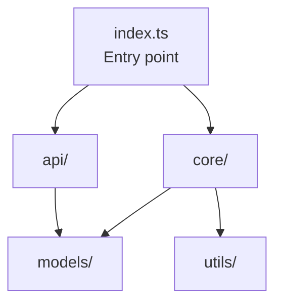

# Repo Explorer

Исследуй репозитории и создавай структурированные отчёты для навигации и понимания кода.

---

## Когда использовать

- Пользователь даёт URL GitHub репозитория и хочет понять его структуру
- Пользователь хочет исследовать текущий локальный репозиторий
- Пользователь просит «изучи проект», «разберись в репо», «составь схему»
- Нужно быстро понять чужую кодовую базу перед разработкой

---

## Парсинг входных данных

Входная строка передаётся после `User:`. Определи тип:

### GitHub URL
Паттерн: `https?://(www\.)?github\.com/[\w.-]+/[\w.-]+`
Извлеки `owner/repo` — это всё после `github.com/` до первого `/` в пути или до конца строки.
Убери `.git` на конце если есть.

Пример: `https://github.com/facebook/react` → `owner=facebook`, `repo=react`

### Локальный репозиторий
Если вход не похож на URL — считай это путь к локальной директории.
Если путь пустой или `.` — используй `cwd` (`ctx.cwd`).
Проверь что директория существует и содержит `.git/`.

### Флаги
- `--map` — только фаза маппинга (дерево + статистика), без глубокого анализа
- `--analyze` — полный анализ (маппинг + AST + отчёт)
- `--sample` — для больших репо (>10k файлов): анализировать только top-level файлы + src/

Если флаги не указаны — по умолчанию `--analyze`.

---

## Кэширование

**Директория:** `.fan/cache/repo-explorer/`

**Ключ кэша:**
- GitHub: `github-{owner}-{repo}.json`
- Local: `local-{absolute-path-hash}.json` (hash от пути через `node -e "console.log(require('crypto').createHash('md5').update(process.argv[1]).digest('hex'))"`)

**TTL:** 24 часа. Проверяй через `analyzedAt` в JSON.

**Загрузка из кэша:**
```bash
CACHE_FILE=".fan/cache/repo-explorer/github-facebook-react.json"
if [ -f "$CACHE_FILE" ]; then
  # Проверь TTL: если analysedAt < 24ч назад — используй кэш
  # Иначе — обнови
fi
```

**Сохранение в кэш:**
```bash
mkdir -p .fan/cache/repo-explorer
# Запиши JSON схему в кэш-файл
```

---

## Фаза 1: Mapping (Составление схемы)

### 1A. GitHub — получение дерева

Шаг 1: Получи SHA последнего коммита на default branch:
```bash
curl -s "https://api.github.com/repos/{owner}/{repo}" | node -e "
  const d = JSON.parse(require('fs').readFileSync(0,'utf8'));
  console.log(JSON.stringify({
    name: d.full_name,
    description: d.description || '',
    stars: d.stargazers_count,
    forks: d.forks_count,
    defaultBranch: d.default_branch,
    size: d.size,
    language: d.language
  }))
"
```

Шаг 2: Получи полное дерево файлов:
```bash
curl -s "https://api.github.com/repos/{owner}/{repo}/git/trees/{sha}?recursive=1" | node -e "
  const d = JSON.parse(require('fs').readFileSync(0,'utf8'));
  if (d.message) { console.error('API Error:', d.message); process.exit(1); }
  const files = d.tree.filter(x => x.type === 'blob');
  const folders = d.tree.filter(x => x.type === 'tree');
  console.log(JSON.stringify({
    files: files.map(f => ({ path: f.path, size: f.size, sha: f.sha })),
    folders: folders.map(f => f.path),
    truncated: d.truncated
  }));
"
```

> **Rate limit:** GitHub API для unauthenticated — 60 req/hour. При ошибке 403/429 — сообщи пользователю и предложи подождать или использовать кэш.

> **Truncated:** Если `truncated: true` — дерево обрезано (>100k файлов). Используй `--sample`.

### 1B. Локальный — получение дерева

Шаг 1: Получи список git-tracked файлов:
```bash
cd {path}
git ls-files
```

Шаг 2: Получи размеры файлов (пакетно через node для скорости):
```bash
git ls-files | node -e "
  const fs = require('fs');
  const path = require('path');
  const lines = require('fs').readFileSync(0,'utf8').trim().split('\n').filter(Boolean);
  const result = lines.map(f => {
    try {
      const stat = fs.statSync(f);
      return { path: f, size: stat.size };
    } catch { return { path: f, size: 0 }; }
  });
  console.log(JSON.stringify(result));
"
```

Шаг 3: Получи метаданные репозитория:
```bash
cd {path}
echo "name: $(basename $(pwd))"
echo "branch: $(git branch --show-current 2>/dev/null || git rev-parse --short HEAD)"
echo "commits: $(git rev-list --count HEAD 2>/dev/null)"
echo "remotes: $(git remote -v 2>/dev/null | head -1)"
```

---

## Фаза 2: Filtering (Очистка)

Используй правила из [filter-patterns.md](references/filter-patterns.md).

Фильтрация выполняется над списком файлов. Удали файлы, пути которых совпадают с паттернами исключения.

```bash
# Пример: отфильтровать node_modules, .git, build artifacts
echo "$FILES_JSON" | node -e "
  const data = JSON.parse(require('fs').readFileSync(0,'utf8'));
  const exclude = [
    'node_modules/', '.git/', 'dist/', 'build/', '.next/', '__pycache__/',
    'target/', '.gradle/', '.idea/', '.vscode/', 'vendor/', '.venv/',
    'coverage/', '.nyc_output/', '.turbo/', '.cache/'
  ];
  const ext = [
    '.min.js', '.min.css', '.map', '.lock', '.log', '.pyc',
    '.class', '.o', '.so', '.dll', '.exe', '.bin', '.wasm',
    '.svg', '.png', '.jpg', '.jpeg', '.gif', '.ico', '.webp',
    '.woff', '.woff2', '.ttf', '.eot', '.mp4', '.mp3'
  ];
  const filtered = data.filter(f =>
    !exclude.some(p => f.path.includes(p)) &&
    !ext.some(e => f.path.endsWith(e))
  );
  console.log(JSON.stringify(filtered));
"
```

После фильтрации проверь количество файлов:
- **≤ 10,000** — продолжай полный анализ
- **> 10,000** — предложи `--sample` или проанализируй только top-level + src/

---

## Фаза 3: Language Detection (Определение языков)

Используй расширения файлов для определения языков. См. [language-patterns.md](references/language-patterns.md).

```bash
# Подсчёт файлов по расширению
echo "$FILTERED_JSON" | node -e "
  const data = JSON.parse(require('fs').readFileSync(0,'utf8'));
  const extMap = {
    '.ts': 'TypeScript', '.tsx': 'TypeScript',
    '.js': 'JavaScript', '.jsx': 'JavaScript', '.mjs': 'JavaScript',
    '.py': 'Python', '.rs': 'Rust', '.go': 'Go',
    '.java': 'Java', '.kt': 'Kotlin', '.kts': 'Kotlin',
    '.c': 'C', '.h': 'C', '.cpp': 'C++', '.hpp': 'C++', '.cc': 'C++',
    '.rb': 'Ruby', '.php': 'PHP', '.swift': 'Swift',
    '.md': 'Markdown', '.json': 'JSON', '.yaml': 'YAML', '.yml': 'YAML',
    '.toml': 'TOML', '.xml': 'XML', '.html': 'HTML', '.css': 'CSS',
    '.scss': 'SCSS', '.sql': 'SQL', '.sh': 'Shell', '.dart': 'Dart',
    '.zig': 'Zig', '.lua': 'Lua', '.r': 'R', '.jl': 'Julia'
  };
  const langCount = {};
  let totalSource = 0;
  data.forEach(f => {
    const ext = '.' + f.path.split('.').pop();
    const lang = extMap[ext];
    if (lang && !['JSON','YAML','TOML','XML','Markdown','HTML','CSS','SCSS'].includes(lang)) {
      langCount[lang] = (langCount[lang] || 0) + 1;
      totalSource++;
    }
  });
  const result = Object.entries(langCount)
    .sort((a,b) => b[1] - a[1])
    .map(([lang, count]) => ({
      language: lang,
      files: count,
      percentage: Math.round(count / totalSource * 100)
    }));
  console.log(JSON.stringify(result));
"
```

Определи **primary language** — язык с наибольшим процентом. Он нужен для выбора AST-паттернов.

---

## Фаза 4: Key Files Identification (Ключевые файлы)

Используй правила из [key-file-patterns.md](references/key-file-patterns.md).

Для каждого ключевого файла:
1. Найди его в отфильтрованном списке
2. Прочитай содержимое (или первые 100 строк для больших файлов)
3. Извлеки релевантную информацию

### README
Найди файл README (README.md, readme.md, README.rst, README.txt, README.adoc).
Прочитай его — это основа для описания проекта.
Извлеки: название, описание, основные фичи, технологии.

### Manifest files
Найди манифесты по расширению проекта:
- JavaScript/TypeScript: `package.json`
- Python: `requirements.txt`, `pyproject.toml`, `setup.py`
- Rust: `Cargo.toml`
- Go: `go.mod`
- Java/Kotlin: `build.gradle`, `pom.xml`
- Ruby: `Gemfile`
- PHP: `composer.json`

Извлеки: dependencies, devDependencies, scripts, version.

### Entry points
- JavaScript/TypeScript: ищи `"main"` в package.json, или `src/index.ts`, `src/main.ts`
- Python: `__main__.py`, `setup.py` (entry_points), `src/__init__.py`
- Rust: `src/main.rs`, `src/lib.rs`
- Go: `main.go`, `cmd/*/main.go`
- Java: `src/main/java/**/Application.java`, `src/main/java/**/Main.java`
- Kotlin: `src/main/kotlin/**/Main.kt`

### Config files
- `.env.example`, `.env.sample`, `config/`, `src/config/`
- `tsconfig.json`, `.eslintrc*`, `jest.config.*`
- `Dockerfile`, `docker-compose.yml`

---

## Фаза 5: AST Analysis (Извлечение символов)

Используй `rg` (ripgrep) для извлечения символов из исходных файлов.
Паттерны для каждого языка — в [language-patterns.md](references/language-patterns.md).

**Стратегия:** Не анализируй ВСЕ файлы. Анализируй только:
1. Entry points (1-3 файла)
2. Файлы в корневых пакетах/модулях (определи по структуре)
3. Файлы с наибольшим количеством импортов (core modules)

Максимум ~50 файлов для AST анализа. Для больших репо — только entry points + top modules.

### Извлечение для одного файла

**TypeScript/JavaScript:**
```bash
# Экспортируемые функции
rg -n "(?:export\s+)?(?:async\s+)?function\s+\w+" "{file}" --no-heading

# Классы
rg -n "(?:export\s+)?(?:abstract\s+)?class\s+\w+" "{file}" --no-heading

# Интерфейсы и типы
rg -n "(?:export\s+)?(?:interface|type)\s+\w+" "{file}" --no-heading

# Импорты
rg -n "^import\s+.+\s+from\s+['\"](.+)['\"]" "{file}" --no-heading
```

**Python:**
```bash
# Функции и классы
rg -n "^(?:async\s+)?def |^class " "{file}" --no-heading

# Импорты
rg -n "^(?:from\s+\S+\s+)?import\s+" "{file}" --no-heading
```

**Rust:**
```bash
# Публичные функции, структуры, трейты
rg -n "pub\s+(?:async\s+)?fn|pub\s+struct|pub\s+enum|pub\s+trait|pub\s+mod" "{file}" --no-heading
```

**Go:**
```bash
# Функции и типы
rg -n "^func |^type \w+\s+(struct|interface)" "{file}" --no-heading

# Импорты
rg -n "^import" "{file}" --no-heading
```

**Java/Kotlin:**
```bash
# Классы и интерфейсы
rg -n "(?:public\s+|private\s+|protected\s+)?(?:abstract\s+)?(?:class|interface|object|enum)\s+\w+" "{file}" --no-heading
```

### Построение dependency map

Для каждого проанализированного файла собери:
- **Импорты** (что импортирует)
- **Экспорты** (что экспортирует)
- **Размер** (строки кода)

На основе этого построй граф зависимостей между модулями. Определи:
- **Core modules** — файлы, которые импортируют многие, но сами импортируют мало
- **Leaf modules** — файлы, которые ничего не импортируют
- **Utility modules** — файлы, которые импортируют многие другие модули

---

## Фаза 6: Architecture Overview (Обзор архитектуры)

На основе собранных данных определи:

### Тип архитектуры
- **Monolith** — единое приложение
- **Monorepo** — несколько пакетов/приложений в одном репо (наличие `packages/`, `apps/`, workspace configs)
- **Library/SDK** — экспортируемый код (фокус на `src/lib`, `index.ts`, Cargo.toml с [lib])
- **CLI tool** — наличие `bin/`, `cli/`, commander/yargs в dependencies
- **Web app** — наличие фреймворков (react, next, vue, express, django, spring)
- **API service** — наличие routes/controllers/handlers
- **Plugin system** — динамическая загрузка модулей

### Структура модулей
Определи основные модули по директориям верхнего уровня:
```
src/
├── core/       → Бизнес-логика
├── api/        → HTTP/API handlers
├── models/     → Модели данных / типы
├── utils/      → Утилиты
├── config/     → Конфигурация
└── index.ts    → Entry point
```

Для каждого модуля определи:
- Назначение (по именам файлов и содержимению)
- Количество файлов
- Зависимости (какие другие модули импортирует)

### Mermaid diagram
Сгенерируй Mermaid graph на основе dependency map:


---

## Фаза 6B: C4 Architecture Report (C4-модель структуры)

На основе данных из Фаз 1–6 построй C4-модель репозитория. Не рисуй выдуманные системы — только то, что реально найдено в коде. Уровень детализации — **Component**.

Построй три уровня: **System Context** → **Container** → **Component** (выбор уровней зависит от типа архитектуры). Каждый уровень — отдельный Mermaid-блок. В итоговом отчёте (Фаза 7) добавь секцию `## C4 Architecture` после `## Архитектура`.

Подробная методология, шаблоны Mermaid для каждого уровня и правила — в [c4-architecture.md](references/c4-architecture.md). Паттерны определения сущностей по коду — в [c4-patterns.md](references/c4-patterns.md).

---

## Фаза 7: Report Generation (Генерация отчёта)

### Выходной формат

Сохраняй в `docs/repo-research/<repo-name>/<Название исследования>.md` по конвенции проекта.

Для GitHub: `<owner>-<repo>` (например, `facebook-react`)
Для локальных: имя директории репозитория

### Шаблон и правила отчёта

Полный шаблон отчёта (все секции: Обзор, Технологии, Зависимости, Структура, Архитектура, C4, Ключевые модули, Entry Points, Следующие шаги) и правила генерации — в [report-template.md](references/report-template.md).

---

## Фаза 8: Save & Cache

### Сохранение отчёта
```bash
mkdir -p docs/repo-research/{repo-name}
# Запиши Markdown отчёт
```

### Обновление кэша
Сохраняй JSON схему в `.fan/cache/repo-explorer/{cache-key}.json`:
```json
{
  "metadata": {
    "platform": "github|local",
    "url": "...",
    "path": "...",
    "name": "...",
    "description": "...",
    "analyzedAt": "{ISO timestamp}"
  },
  "stats": {
    "fileCount": 0,
    "folderCount": 0,
    "totalSize": 0,
    "primaryLanguage": "..."
  },
  "languages": [...],
  "tree": [...],
  "keyFiles": [...]
}
```

---

## Обработка ошибок

| Ситуация | Действие |
|----------|----------|
| GitHub API 404 | «Репозиторий не найден или приватный. Поддерживаются только публичные репозитории.» |
| GitHub API 403/429 | «Rate limit exceeded. Подождите или используйте кэш.» |
| GitHub API `truncated: true` | Предложи `--sample`, проанализируй только часть |
| Нет `.git/` в локальной директории | «Не Git-репозиторий. Укажите корректный путь.» |
| >10,000 файлов без `--sample` | «Репозиторий слишком большой ({N} файлов). Используйте --sample для частичного анализа.» |
| Пустой репозиторий (0 файлов) | «Репозиторий пуст.» |
| Нет ключевых файлов | Продолжи без них, предупредив пользователя |

---
## Пример использования

### GitHub репозиторий
```
User: https://github.com/expressjs/express

→ Определяю: GitHub, owner=expressjs, repo=express
→ Проверяю кэш... не найден
→ Фаза 1: Получаю дерево через GitHub Trees API...
→ Фаза 2: Фильтрую 1,247 файлов → 312 исходных
→ Фаза 3: Languages: JavaScript 94%, HTML 4%, JSON 2%
→ Фаза 4: Key files: package.json, README.md, lib/express.js
→ Фаза 5: AST parsing 15 core files...
→ Фаза 6: Architecture: Library/SDK, middleware-based
→ Фаза 7: Генерирую отчёт...
→ Сохраняю: docs/repo-research/expressjs-express/Express.js исследование.md
→ Обновляю кэш...
→ Готово!
```

### Локальный репозиторий
```
User: --analyze

→ Определяю: локальный репозиторий (cwd)
→ Проверяю .git/... найден
→ Проверяю кэш... не найден
→ Фаза 1: git ls-files → 245 файлов
→ Фаза 2: Фильтрую → 178 исходных
→ ...далее по фазам...
→ Готово!
```

---
## Справочные материалы

- [Фильтрующие паттерны](references/filter-patterns.md)
- [Языковые паттерны для AST](references/language-patterns.md)
- [Ключевые файлы](references/key-file-patterns.md)
- [C4 модель — паттерны определения сущностей](references/c4-patterns.md)
