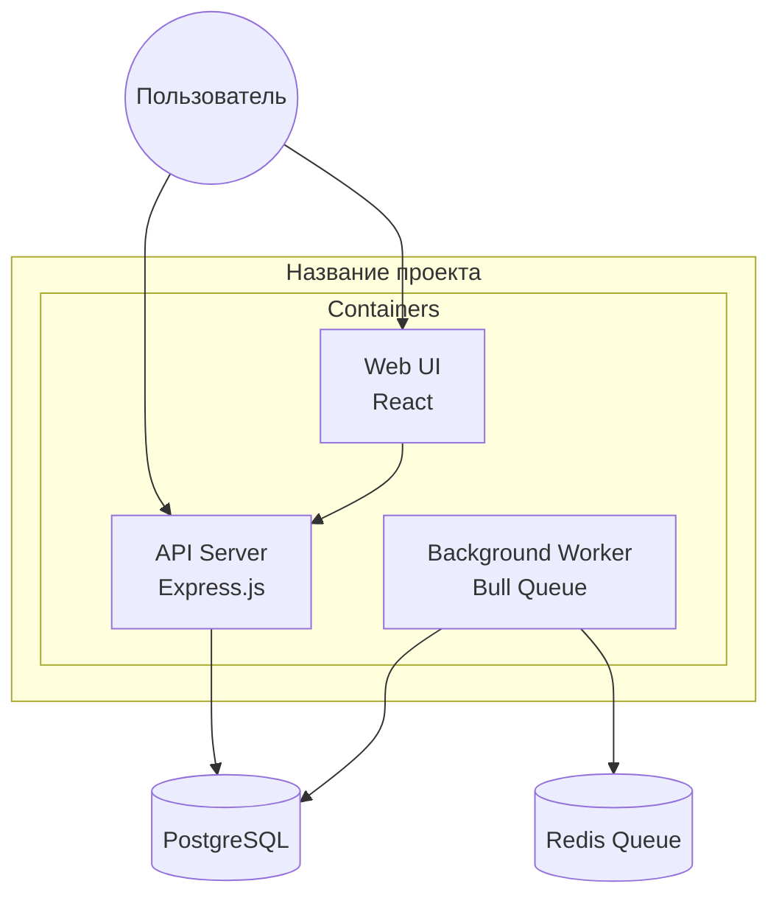
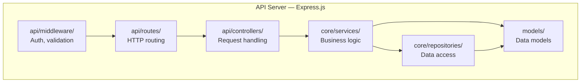

# C4 Architecture — Методология построения

Справочник для Фазы 6B repo-explorer. Как построить C4-модель репозитория на основе данных из Фаз 1–6. Не рисуй выдуманные системы — только то, что реально найдено в коде. Уровень детализации — **Component** (внутренние модули, классы, функции).

См. также: [c4-patterns.md](c4-patterns.md) — определение конкретных сущностей по коду.

---

## Правила C4-отчёта

1. **Source of truth — код.** Каждая сущность на диаграмме должна иметь соответствие в реальных файлах/директориях репозитория. Не придумывай базы данных, брокеры сообщений или внешние сервисы, если их нет в конфигах и коде.
2. **Автоматический выбор уровней.** На основе типа архитектуры (Фаза 6) определи, какие уровни C4 релевантны:

   | Тип архитектуры | Уровни C4 |
   |---|---|
   | Monolith | System Context → Container → Component |
   | Monorepo | System Context (per package) → Container → Component |
   | Library/SDK | Container → Component |
   | CLI tool | System Context → Container → Component |
   | Web app | System Context → Container → Component |
   | API service | System Context → Container → Component |

3. **Один Mermaid-блок на уровень.** Каждый уровень — отдельный `mermaid` код-блок. Не смешивай.

---

## Level 1: System Context

Показывает систему в целом и её внешние зависимости.

**Что рисовать:**
- Сама система как один бокс (название из README/package.name/Cargo.toml)
- Внешние зависимости, найденные в коде:
  - Базы данных (по драйверам: `pg`, `mongodb`, `sqlite3`, `prisma`, `typeorm`, ` diesel`, `sqlx`)
  - Брокеры сообщений (Kafka, RabbitMQ, Redis pub/sub — по клиентским библиотекам)
  - Внешние API (по HTTP-клиентам: `axios`, `fetch`, `reqwest`, `hyper`)
  - Кэш (Redis, Memcached — по клиентам)
  - Файловое хранилище (S3, GCS — по SDK)
  - Аутентификация (OAuth провайдеры, JWT, OIDC)
- Пользователи/акторы (по ролям из README или кода: admin, user, service)

**Шаблон Mermaid:**
```mermaid
graph TB
    subgraph External [Внешние зависимости]
        User((Пользователь))
        DB[(PostgreSQL)]
        Cache[(Redis)]
    end

    System[{Название проекта}]

    User --> System
    System --> DB
    System --> Cache
```

> Если система — библиотека/SDK и не взаимодействует с внешними зависимостями напрямую — пропусти этот уровень.

---

## Level 2: Container

Декомпозиция системы на контейнеры (подсистемы, сервисы, CLI, UI).

**Что рисовать:**
- Для **monolith**: frontend, backend, API layer, background workers, scheduled tasks
- Для **monorepo**: каждый package/app как отдельный контейнер
- Для **web app**: web framework, static files, API routes
- Для **API service**: HTTP server, WebSocket layer, gRPC layer
- Для **CLI**: CLI binary, config layer, core logic

**Определи контейнеры по:**
- Директориям верхнего уровня (`src/`, `lib/`, `bin/`, `web/`, `api/`, `packages/*/`)
- Фреймворкам (React/Vue → «Web UI», Express/FastAPI/Spring → «API Server»)
- Процессам из конфигов (docker-compose services, Procfile, Makefile targets)

**Шаблон Mermaid:**


---

## Level 3: Component

Внутренняя структура каждого контейнера — модули, классы, ключевые функции.

**Что рисовать:**
- Модули из структуры директорий (src/core/, src/api/, src/models/)
- Ключевые классы и функции из AST-анализа (Фаза 5)
- Связи между модулями из dependency map

**Правила детализации:**
- Не более 10-15 компонентов на диаграмму (больше — разнеси на несколько диаграмм по контейнерам)
- Каждый компонент — это модуль/директория, а не отдельный файл (кроме entry points)
- Показывай тип: `[Module]` для обычных, `[(Storage)]` для DAL/repositories, `[API]` для controllers/routes

**Шаблон Mermaid:**


---

## Генерация C4-секции в отчёте

В итоговом отчёте (Фаза 7) добавь секцию `## C4 Architecture` **после** секции `## Архитектура`. Структура:

```markdown
## C4 Architecture

### System Context
{Краткое описание: что это за система, кто с ней взаимодействует, внешние зависимости}


tagged c4Context

### Containers
{Описание контейнеров: из чего состоит система на высоком уровне}


tagged c4Container

### Components
{Описание компонентов: внутренняя структура ключевых контейнеров}


tagged c4Component
```
